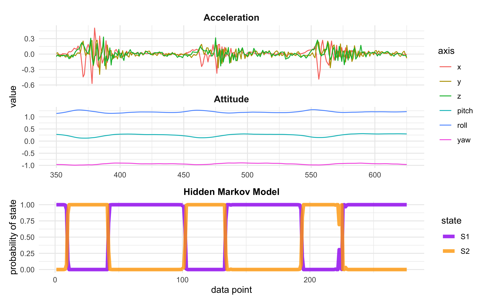

# Analysis of Telemetry Data

## EDA and Modeling

To begin with, I manually cropped a section of data from a set of push-ups to isolate 3 reps.
A Hidden Markov Model with 2 hidden states and using each axis of motion (3 d.o.f. of acceleration and 3 d.o.f. of attitude) produced the best model by AIC and BIC.

Below is the raw data used to fit the model and the HMM's predicted states.
The states seems to capture the push-ups quite well.

---

## To-Do

### Apple watch backgrounding during data collection

The watch app is being backgrounded during data collection, cutting of the data stream.
I need to initialize a workout session to access specific background privleges on the watch.

### Fitting raw and messy data

The data will always be capped by pre- and post- exercise noise.
I do not know how the model will react to this portion of the data, though, in actual use, it will not be clipped off beforehand.
