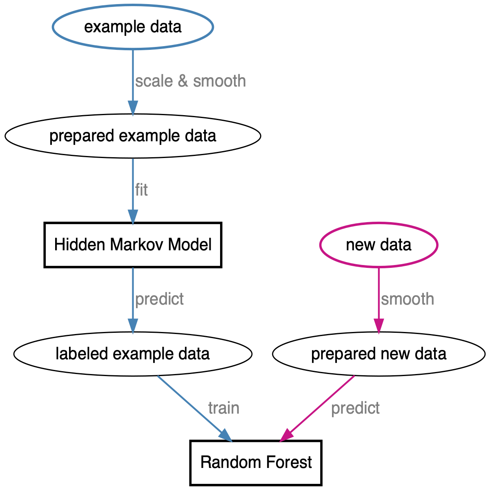
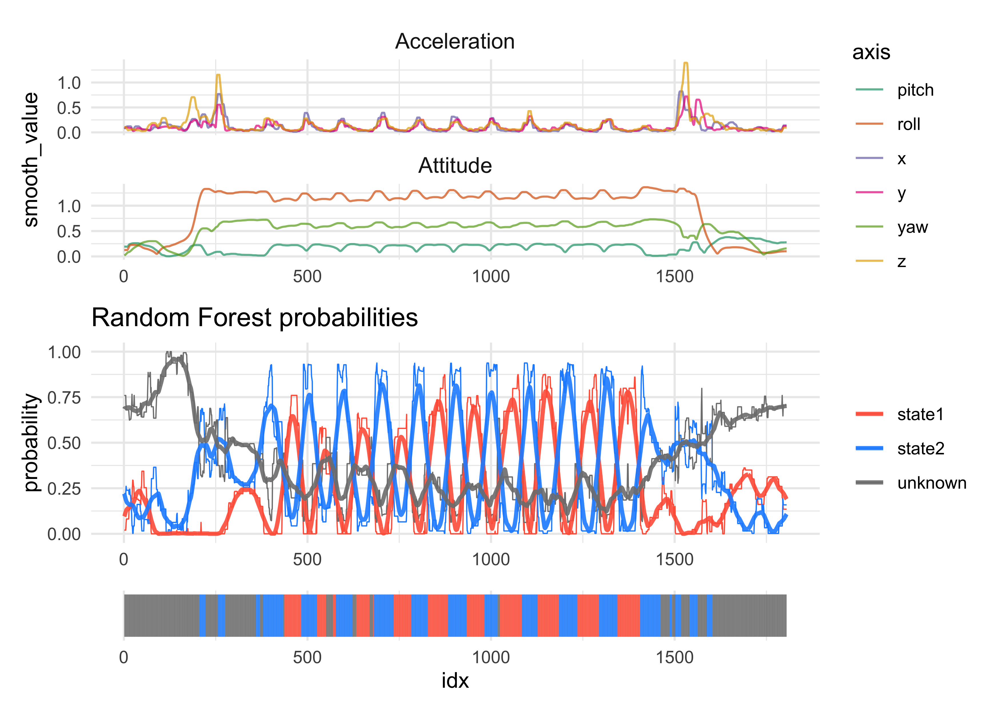

# Analysis of Telemetry Data

1. [Exploration of the data and modeling the data](analysis/05_005_hidden-markov-modeling.md)
2. [Experimentation of a data processing and classification workflow](analysis/05_008_hmm_pipelines.md)
3. [Hyperparameter tuning of the Random Forest Classifier](analysis/05_010_random-forest-hyperparam-tuning.md)
3. [Refinement of the classifier training and implementation pipeline](analysis/05_011_classifier-training-implementation-pipeline.md) (in progress)

## Classifier training and implementation pipepline

See the [original notebook](analysis/05_011_classifier-training-implementation-pipeline.md) for details.

Below is a flowchart of the pipeline used for this modeling process.

A random forest fit on one set of data was able to reliably identify the states of the exercise from completely new push-up data.

---

### To-Do

1. The RF is having difficulty with identifying the push-up states in new data. I need to som planning and brainstorming to figure out ways to improve this.
