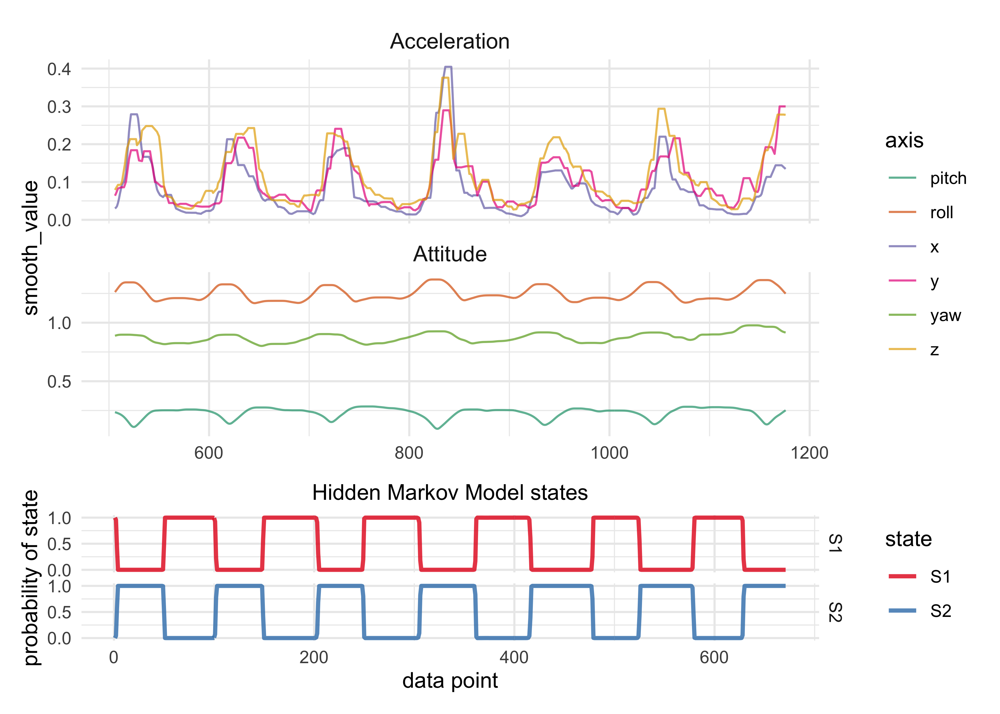
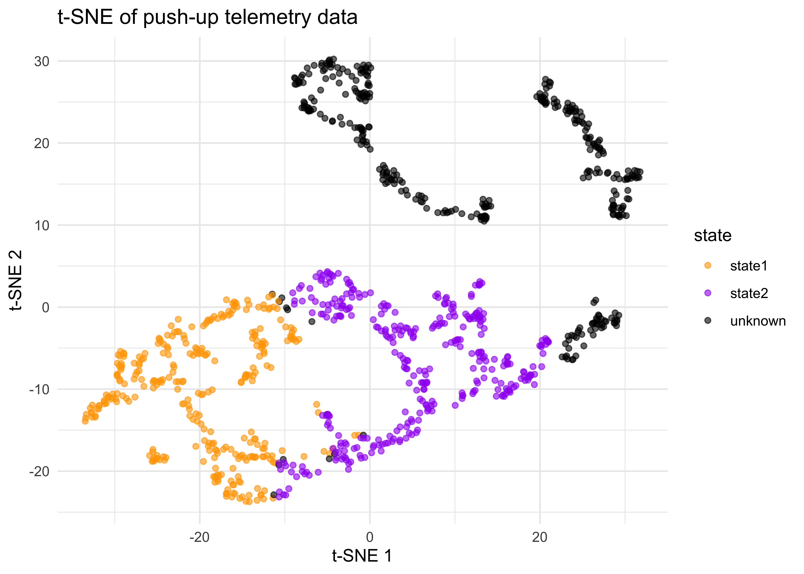

# Analysis of Telemetry Data

## EDA and Modeling

To begin with, I manually cropped a section of data from a set of push-ups to isolate 3 reps.
A Hidden Markov Model with 2 hidden states and using each axis of motion (3 d.o.f. of acceleration and 3 d.o.f. of attitude) produced the best model by AIC and BIC.

Below is the raw data used to fit the model and the HMM's predicted states.
The states seems to capture the push-ups quite well.

## Classifier training pipeline

The goal is to be able to automatically create training data for a classifier.
A successful pipeline will require little-to-no user intervention and can theoretically be deployed to run on-device.

### Data preparation

Smoothing and scaling the data helps the HMM identify the states of a push-up.

### Auto-generated training data

The HMM splits the raw data into data to train a classifier.

### Training a classifer

Finally, a classifier can be trained on this automatically-generated training data.
This portion of the pipeline is currently being developed, but it is already showing promising results.
Below are the results of a coarse grid search of the 'neighbors' parameter of a kNN classifier.
The top plot is on the testing split of the data, i.e. data that the model has never seen before.

---

## To-Do

### Classifier selection

I am currently in the process of training and testing various types of classifiers.
Eventually either a single classifier needs to be chosen or an ensemble model needs to be built from the best classifiers.
