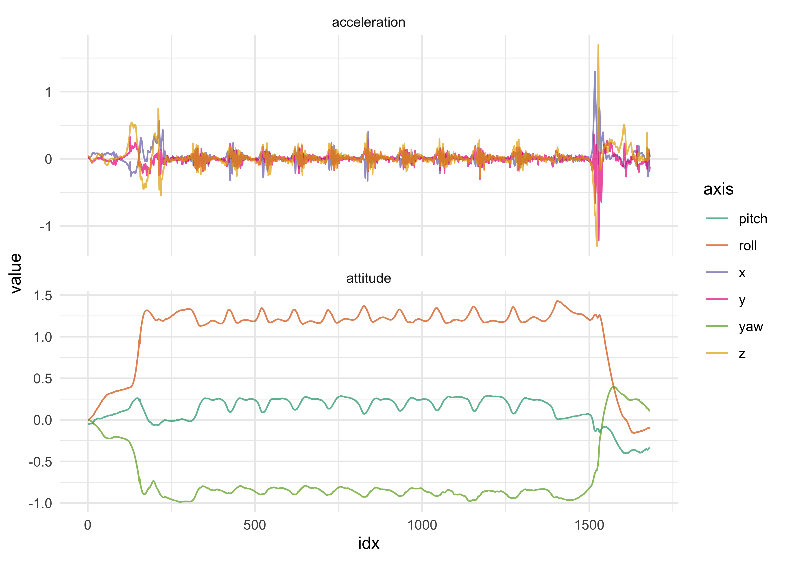
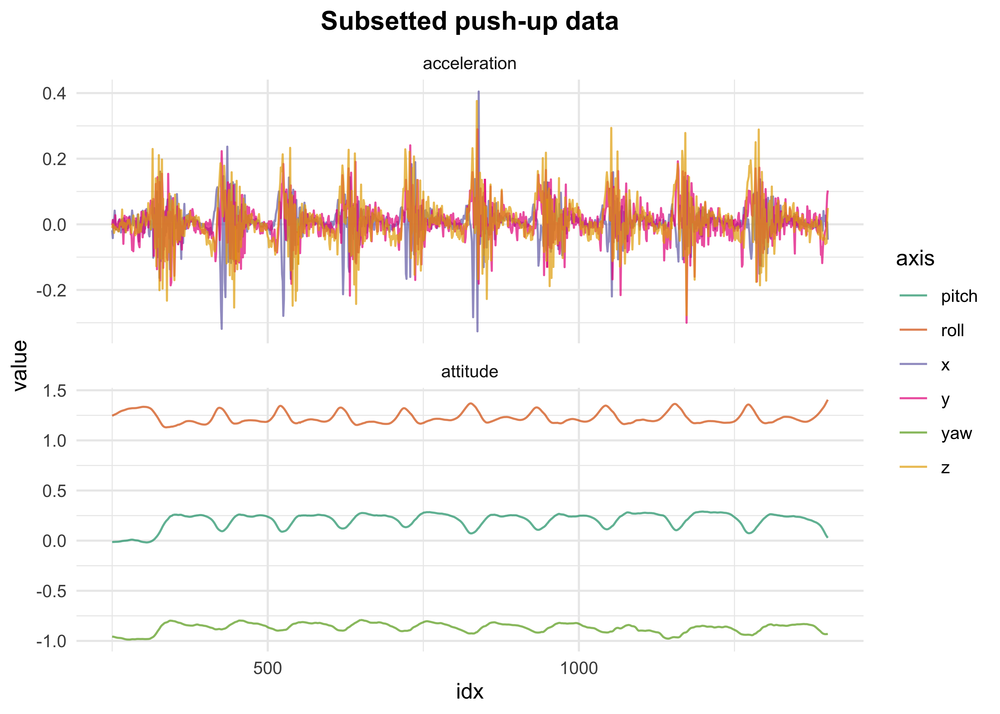
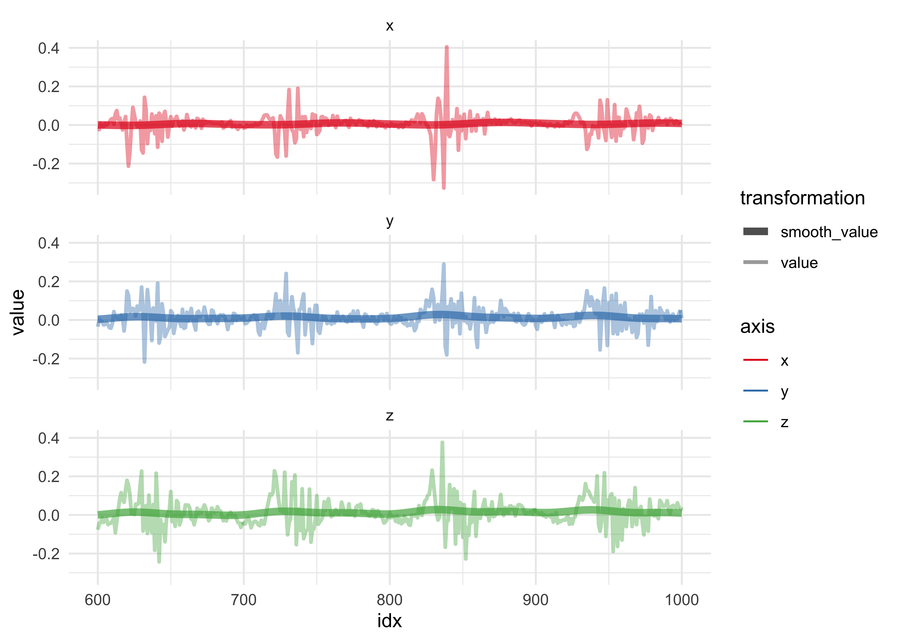
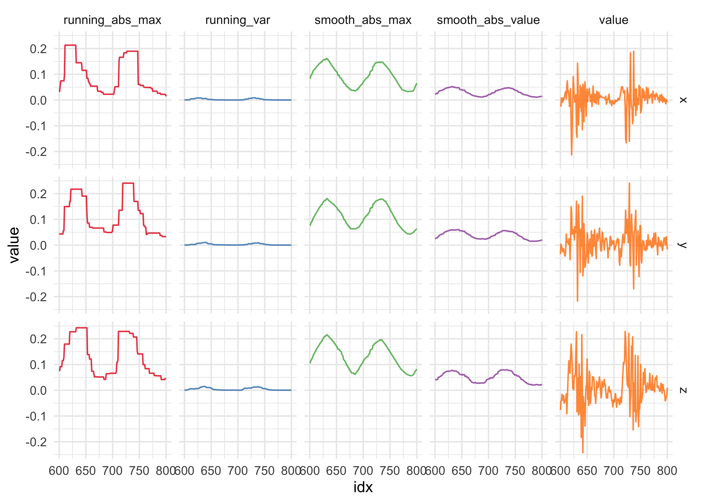
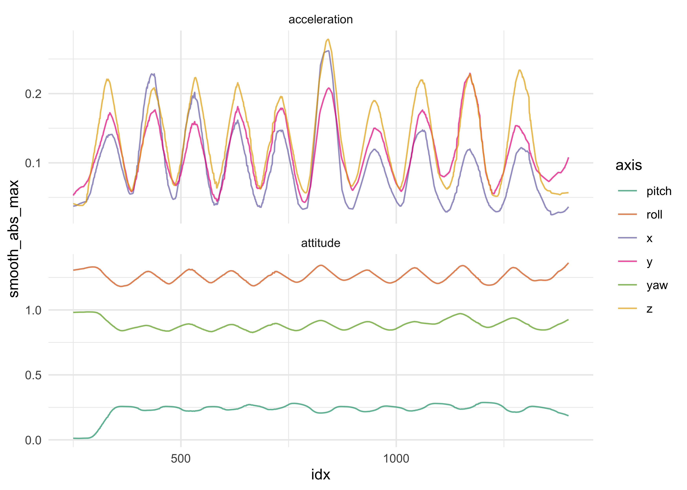
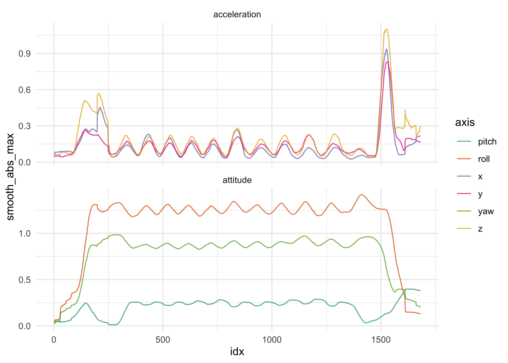
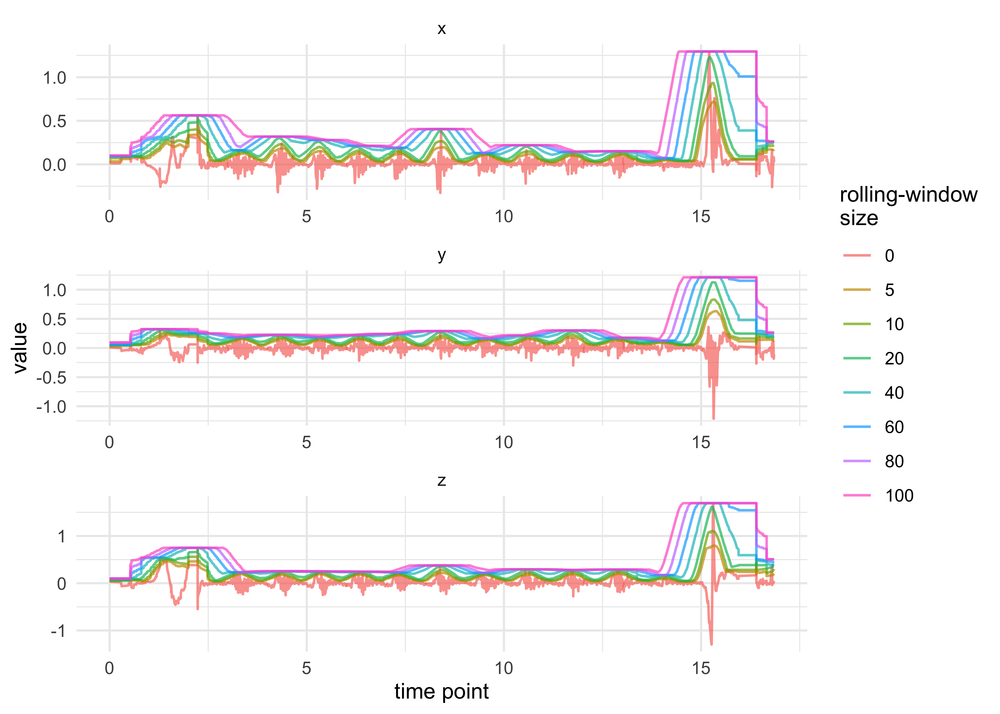
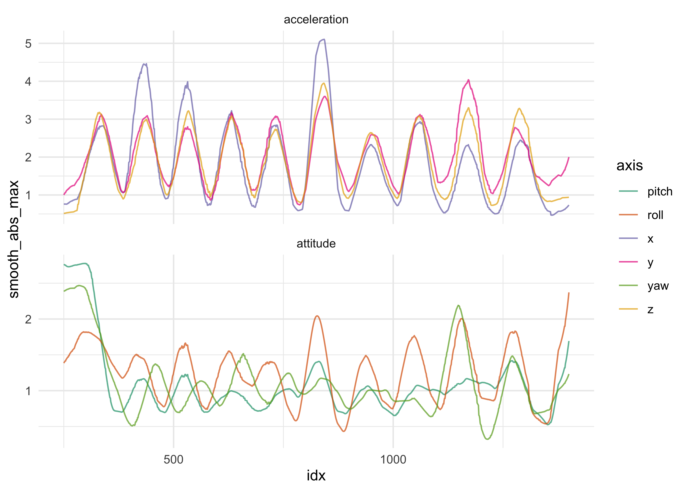
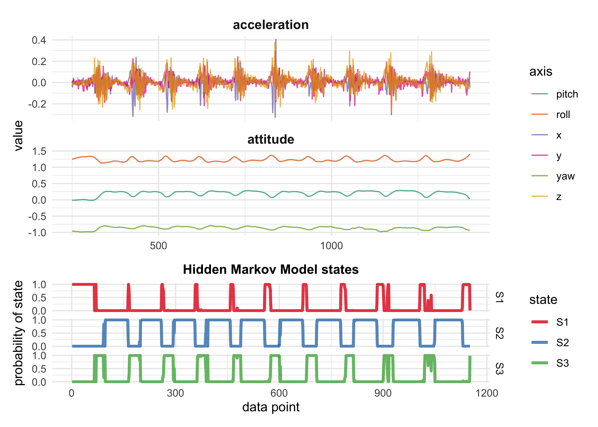
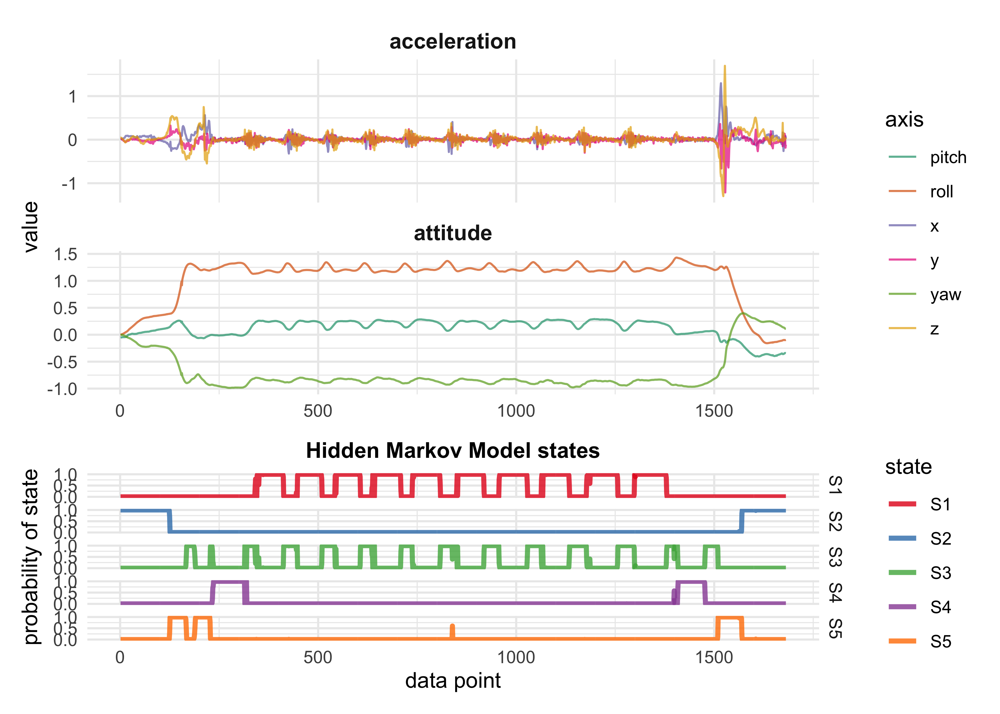

Hidden Markov Modeling
================

    suppressPackageStartupMessages(library(depmixS4))

Exploratoring the data
======================

Load in some push-up data and explore the numbers.

    all_data_files <- get_data_file_names(data_dir)
    raw_pushup_data <- read_watch_data(all_data_files[2])

    #> Warning: Unknown or uninitialised column: `date`.

    #> Warning: Unknown or uninitialised column: `date`.

    raw_pushup_telemetry_data <- raw_pushup_data$telemetry_data

Plot the data over time.

    line_plot_telemetry <- function(df, x = value) {
      df %>%
        ggplot(aes(idx, {{ x }})) +
        facet_wrap(~ motion, ncol = 1, scales = "free_y") +
        geom_line(aes(color = axis), alpha = 0.7) +
        scale_color_brewer(type = "qual", palette = "Dark2")
    }

    line_plot_telemetry(raw_pushup_telemetry_data)

<!-- -->

Subset just the portions of the data where the push-ups are. This is
some usefuly “clean” data for initial model fitting and testing.

    clean_pushup_data <- raw_pushup_telemetry_data %>%
      filter(between(idx, 250, 1400))
    line_plot_telemetry(clean_pushup_data) +
      theme(
        plot.title = element_text(hjust = 0.5, face = "bold")
      ) +
      labs(title = "Subsetted push-up data")

<!-- -->

Data transformations
--------------------

### Smoothened data

The `ksmooth` function from the ‘stats’ package has 2 kernel methods:
*normal* and *box*.

    clean_pushup_data %.% {
      group_by(axis, motion)
      mutate(smooth_value = ksmooth(date, value, kernel = "normal")$y)
      ungroup()
    } %>%
      line_plot_telemetry(smooth_value)

<!-- -->

    clean_pushup_data %.% {
      group_by(axis, motion)
      mutate(smooth_value = ksmooth(date, value, kernel = "box")$y)
      ungroup()
    } %>%
      line_plot_telemetry(smooth_value)

<!-- -->

In general, smoothing the data seems to have a larger effect on the
acceleration data. Because the acceleration seems to oscillate back and
forth very rapidly, the smoothing just crishes it back towards 0.

    clean_pushup_data %.% {
      group_by(axis, motion)
      mutate(smooth_value = ksmooth(date, value, kernel = "normal")$y)
      ungroup()
      filter(between(idx, 600, 1000))
      pivot_longer(
        -c(date, idx, axis, motion),
        names_to = "transformation",
        values_to = "value"
      )
      filter(motion == "acceleration")
    } %>%
      ggplot(aes(idx, value)) +
      facet_wrap(~ axis, ncol = 1) +
      geom_line(aes(color = axis, alpha = transformation, size = transformation)) +
      scale_color_brewer(type = "qual", palette = "Set1") +
      scale_size_manual(values = c(2, 1)) +
      scale_alpha_manual(values = c(0.7, 0.4))

<!-- -->

Perhaps, a running measure of values could be informative.

    # Performs an action `fxn` on a running basis over `x`.
    running_fxn <- function(x, fxn, n = 5) {
      y <- x
      for (i in seq(1, length(x))) {
        x_i <- c()
        for (j in seq(-n, n)) {
          idx <- i + j
          if (idx < 1 | idx > length(x)) { next }
          x_i <- c(x_i, x[[idx]])
        }
        y[[i]] <- fxn(x_i)
      }
      return(y)
    }

Below are plots of the acceleration data with a few different
transformations. A possible conclusion is that it may not be the actual
acceleration values that matter, but how variable the data is. The
`smooth_abs_max` value looks very promising. It is the smoothened
version of `running_abs_max` which is maximum absolute value on a
running-basis (± 10 positions on either side).

    clean_pushup_data %.% {
      group_by(axis, motion)
      mutate(
        running_var = running_fxn(value, fxn = var, n = 10),
        running_abs_max = running_fxn(abs(value), fxn = max, n = 10),
        smooth_abs_value = ksmooth(date, abs(value), kernel = "box")$y,
        smooth_abs_max = ksmooth(date, running_abs_max, kernel = "box")$y
      )
      ungroup()
      filter(between(idx, 600, 800))
      pivot_longer(
        -c(date, idx, axis, motion),
        names_to = "transformation",
        values_to = "value"
      )
      filter(motion == "acceleration")
    }%>%
      ggplot(aes(idx, value)) +
      facet_grid(axis ~ transformation) +
      geom_line(aes(color = transformation), alpha = 0.8) +
      scale_color_brewer(type = "qual", palette = "Set1", guide = FALSE) 

<!-- -->

The smoothening method on the cleaned push-up data.

    clean_pushup_data %.% {
      group_by(axis, motion)
      mutate(
        running_abs_max = running_fxn(abs(value), fxn = max, n = 10),
        smooth_abs_max = ksmooth(date, running_abs_max, kernel = "box")$y
      )
      ungroup()
    } %>%
      line_plot_telemetry(smooth_abs_max)

<!-- -->

The smoothening method on the raw push-up data (all of the data, not
just the clipped middle portion).

    raw_pushup_telemetry_data %.% {
      group_by(axis, motion)
      mutate(
        running_abs_max = running_fxn(abs(value), fxn = max, n = 10),
        smooth_abs_max = ksmooth(date, running_abs_max, kernel = "box")$y
      )
      ungroup()
    } %>%
      line_plot_telemetry(smooth_abs_max)

<!-- -->

### Scaled data

    zscale <- function(x, na.rm = TRUE) {
      (x - mean(x, na.rm = na.rm)) / sd(x, na.rm = na.rm)
    }

    clean_pushup_data %.% {
      group_by(axis, motion)
      mutate(
        scaled_value = zscale(value)
      )
      ungroup()
    } %>%
      line_plot_telemetry(scaled_value)

<!-- -->

Applying the smoothing method from above to scaled data.

    clean_pushup_data %.% {
      group_by(axis, motion)
      mutate(
        scaled_value = zscale(value),
        running_abs_max = running_fxn(abs(scaled_value), fxn = max, n = 10),
        smooth_abs_max = ksmooth(date, running_abs_max, kernel = "box")$y
        
      )
      ungroup()
    } %>%
      line_plot_telemetry(smooth_abs_max)

<!-- -->

The scaled smooth data looks very promising.

    raw_pushup_telemetry_data %.% {
      group_by(axis, motion)
      mutate(
        scaled_value = zscale(value),
        running_abs_max = running_fxn(abs(scaled_value), fxn = max, n = 10),
        smooth_abs_max = ksmooth(date, running_abs_max, kernel = "box")$y
        
      )
      ungroup()
    } %>%
      line_plot_telemetry(smooth_abs_max)

<!-- -->

Exploration of Hidden Markov Models (HMM)
-----------------------------------------

    pivot_telemetry_data <- function(telemetry_data) {
      telemetry_data %>%
        pivot_wider(
          c(date, idx),
          names_from = axis,
          values_from = value
        )
    }

    construct_full_telemetry_hmm_model <- function(d, nstates) {
      depmix(
        list(
          x ~ 1,
          y ~ 1,
          z ~ 1,
          pitch ~ 1,
          roll ~ 1,
          yaw ~ 1
        ),
        nstates = nstates,
        family = list(
          gaussian(), gaussian(), gaussian(),
          gaussian(), gaussian(), gaussian()
        ),
        data = d
      )
    }

    construct_accel_telemetry_hmm_model <- function(d, nstates) {
      depmix(
        list(
          x ~ 1,
          y ~ 1,
          z ~ 1
        ),
        nstates = nstates,
        family = list(gaussian(), gaussian(), gaussian()),
        data = d
      )
    }

    construct_attitude_telemetry_hmm_model <- function(d, nstates) {
      depmix(
        list(
          pitch ~ 1,
          roll ~ 1,
          yaw ~ 1
        ),
        nstates = nstates,
        family = list(gaussian(), gaussian(), gaussian()),
        data = d
      )
    }

    pushup_data_wide <- pivot_telemetry_data(clean_pushup_data)

    hmm_construction_functions <- c(
      construct_full_telemetry_hmm_model,
      construct_accel_telemetry_hmm_model,
      construct_attitude_telemetry_hmm_model
    )

    hmm_cleaned_models <- tibble(
      nstates = rep(c(2, 3), 3),
      fxn = rep(hmm_construction_functions, each = 2)
    ) %>%
      mutate(
        model = map2(fxn, nstates, ~ .x(d = pushup_data_wide, nstates = .y)),
        fit = map(model, fit),
        aic = map_dbl(fit, AIC),
        bic = map_dbl(fit, BIC)
      )

    #> converged at iteration 12 with logLik: 12458.72 
    #> converged at iteration 20 with logLik: 13035.3 
    #> converged at iteration 12 with logLik: 6089.985 
    #> converged at iteration 80 with logLik: 6319.58 
    #> converged at iteration 16 with logLik: 7182.697 
    #> converged at iteration 35 with logLik: 7631.297

    hmm_cleaned_models

    #> # A tibble: 6 x 6
    #>   nstates fxn    model    fit            aic     bic
    #>     <dbl> <list> <list>   <list>       <dbl>   <dbl>
    #> 1       2 <fn>   <depmix> <dpmx.ftt> -24863. -24727.
    #> 2       3 <fn>   <depmix> <dpmx.ftt> -25983. -25760.
    #> 3       2 <fn>   <depmix> <dpmx.ftt> -12150. -12074.
    #> 4       3 <fn>   <depmix> <dpmx.ftt> -12587. -12456.
    #> 5       2 <fn>   <depmix> <dpmx.ftt> -14335. -14260.
    #> 6       3 <fn>   <depmix> <dpmx.ftt> -15211. -15079.

    plot_hmm_results <- function(hmm_fit) {
      posterior(hmm_fit) %>%
        as_tibble() %>%
        mutate(idx = row_number()) %>%
        pivot_longer(-c(idx, state)) %>%
        ggplot(aes(x = idx, y = value, color = name)) +
        facet_grid(name ~ .) +
        geom_line(size = 1.2, alpha = 0.8) +
        scale_color_brewer(type = "qual", palette = "Set1") +
        scale_y_continuous(breaks = c(0, 0.5, 1)) +
        theme(
          plot.title = element_text(hjust = 0.5, size = 11, face = "bold"),
        ) +
        labs(
          x = "data point",
          y = "probability of state",
          color = "state",
          title = "Hidden Markov Model states"
        )
    }

    data_and_hmm_plot <- function(model_data, hmm_fit) {
      data_p <- model_data %>%
        mutate(motion_type = str_to_title(axis)) %>%
        line_plot_telemetry() +
        labs(
          x = NULL,
          y = "value"
        ) +
        theme(
          strip.text = element_text(size = 11, face = "bold")
        )

      hmm_p <- plot_hmm_results(hmm_fit)

      data_p / hmm_p
    }

    get_best_model <- function(model_df) {
      model_df$fit[which.min(model_df$aic)][[1]]
    }

    best_cleaned_model <- get_best_model(hmm_cleaned_models)
    summary(best_cleaned_model)

    #> Initial state probabilities model 
    #> pr1 pr2 pr3 
    #>   1   0   0 
    #> 
    #> Transition matrix 
    #>         toS1  toS2  toS3
    #> fromS1 0.933 0.000 0.067
    #> fromS2 0.015 0.985 0.000
    #> fromS3 0.008 0.036 0.956
    #> 
    #> Response parameters 
    #> Resp 1 : gaussian 
    #> Resp 2 : gaussian 
    #> Resp 3 : gaussian 
    #> Resp 4 : gaussian 
    #> Resp 5 : gaussian 
    #> Resp 6 : gaussian 
    #>     Re1.(Intercept) Re1.sd Re2.(Intercept) Re2.sd Re3.(Intercept) Re3.sd
    #> St1           0.008  0.019          -0.010  0.037          -0.015  0.027
    #> St2           0.007  0.026           0.002  0.040           0.000  0.047
    #> St3          -0.007  0.094           0.036  0.088           0.046  0.111
    #>     Re4.(Intercept) Re4.sd Re5.(Intercept) Re5.sd Re6.(Intercept) Re6.sd
    #> St1           0.113  0.092           1.287  0.038          -0.933  0.042
    #> St2           0.253  0.018           1.192  0.019          -0.841  0.024
    #> St3           0.140  0.047           1.269  0.065          -0.889  0.037

    data_and_hmm_plot(clean_pushup_data, best_cleaned_model) +
      plot_layout(heights = c(2, 1))

<!-- -->

    raw_pushup_wide <- pivot_telemetry_data(raw_pushup_telemetry_data)

    hmm_raw_models <- tibble(
      nstates = c(2:5),
      fxn = rep(c(construct_full_telemetry_hmm_model), 4)
    ) %>%
      mutate(
        model = map2(fxn, nstates, ~ .x(d = raw_pushup_wide, nstates = .y)),
        fit = map(model, fit),
        aic = map_dbl(fit, AIC),
        bic = map_dbl(fit, BIC)
      )

    #> converged at iteration 12 with logLik: 10434.93 
    #> converged at iteration 26 with logLik: 11573.8 
    #> converged at iteration 20 with logLik: 14354.5 
    #> converged at iteration 113 with logLik: 15119.44

    hmm_raw_models

    #> # A tibble: 4 x 6
    #>   nstates fxn    model    fit            aic     bic
    #>     <int> <list> <list>   <list>       <dbl>   <dbl>
    #> 1       2 <fn>   <depmix> <dpmx.ftt> -20816. -20669.
    #> 2       3 <fn>   <depmix> <dpmx.ftt> -23060. -22821.
    #> 3       4 <fn>   <depmix> <dpmx.ftt> -28583. -28241.
    #> 4       5 <fn>   <depmix> <dpmx.ftt> -30071. -29615.

    best_raw_model <- get_best_model(hmm_raw_models)
    summary(best_raw_model)

    #> Initial state probabilities model 
    #> pr1 pr2 pr3 pr4 pr5 
    #>   0   1   0   0   0 
    #> 
    #> Transition matrix 
    #>         toS1  toS2  toS3  toS4  toS5
    #> fromS1 0.983 0.000 0.017 0.000 0.000
    #> fromS2 0.000 0.996 0.000 0.000 0.004
    #> fromS3 0.026 0.000 0.963 0.007 0.004
    #> fromS4 0.000 0.000 0.020 0.980 0.000
    #> fromS5 0.000 0.007 0.014 0.000 0.979
    #> 
    #> Response parameters 
    #> Resp 1 : gaussian 
    #> Resp 2 : gaussian 
    #> Resp 3 : gaussian 
    #> Resp 4 : gaussian 
    #> Resp 5 : gaussian 
    #> Resp 6 : gaussian 
    #>     Re1.(Intercept) Re1.sd Re2.(Intercept) Re2.sd Re3.(Intercept) Re3.sd
    #> St1           0.007  0.026           0.003  0.039           0.000  0.046
    #> St2           0.023  0.066          -0.016  0.062           0.069  0.117
    #> St3           0.002  0.077           0.010  0.085           0.006  0.122
    #> St4           0.002  0.023           0.001  0.033           0.003  0.025
    #> St5           0.175  0.282           0.005  0.230           0.073  0.440
    #>     Re4.(Intercept) Re4.sd Re5.(Intercept) Re5.sd Re6.(Intercept) Re6.sd
    #> St1           0.252  0.019           1.192  0.019          -0.842  0.025
    #> St2          -0.145  0.204           0.127  0.197           0.041  0.225
    #> St3           0.135  0.058           1.273  0.060          -0.893  0.038
    #> St4           0.010  0.021           1.309  0.051          -0.961  0.017
    #> St5           0.004  0.138           0.978  0.309          -0.450  0.404

    data_and_hmm_plot(raw_pushup_telemetry_data, best_raw_model) +
      plot_layout(heights = c(2, 1))

<!-- -->
