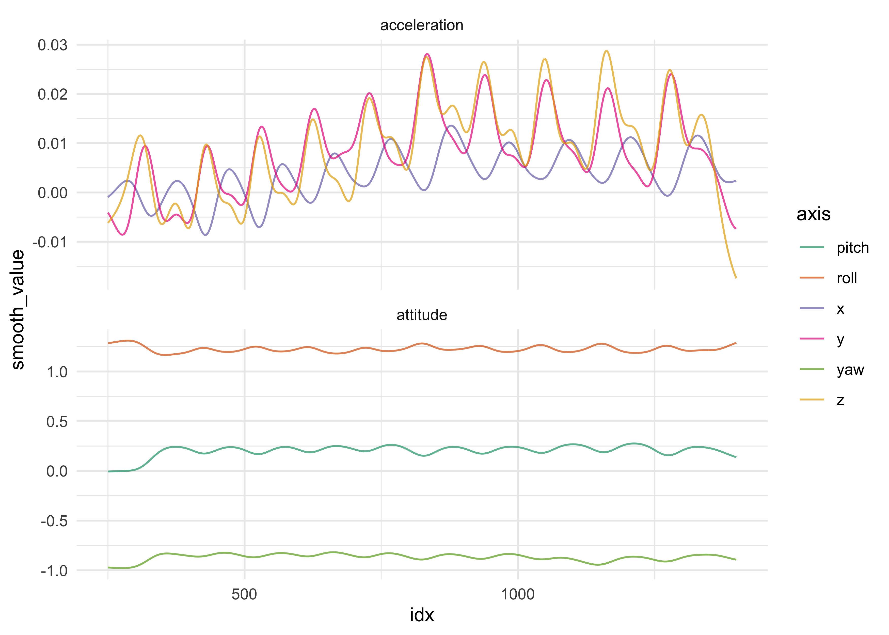
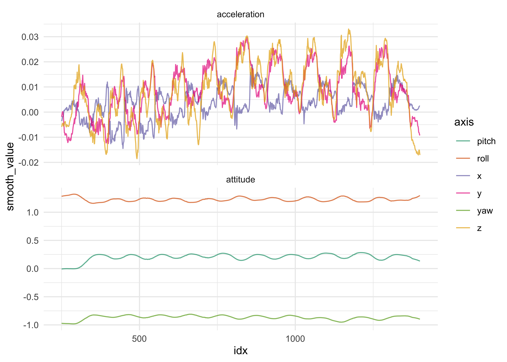
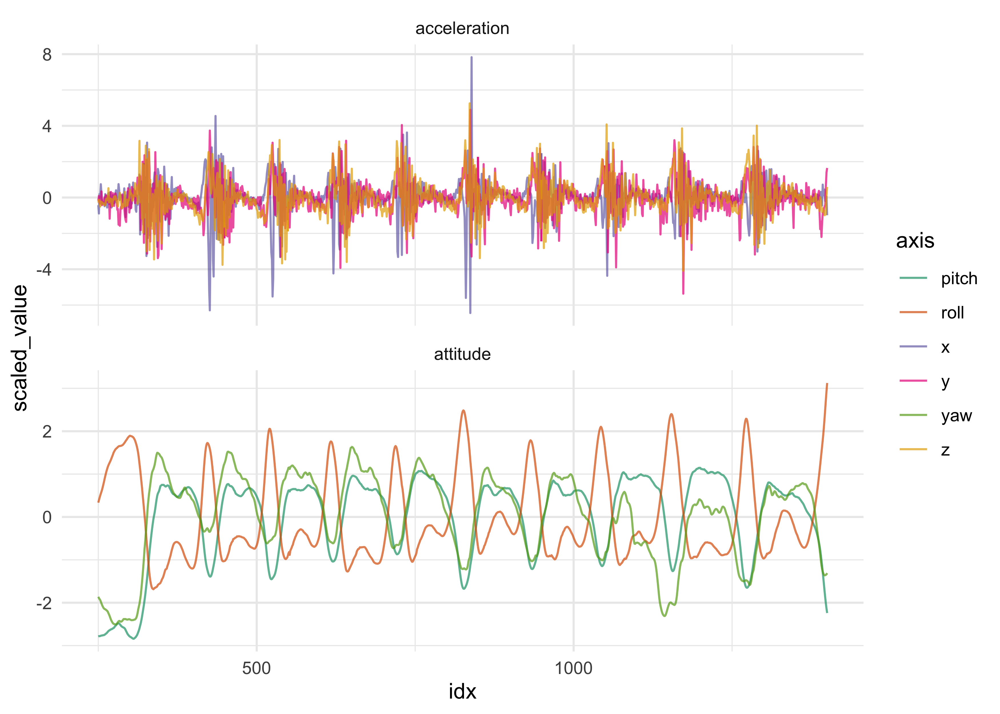
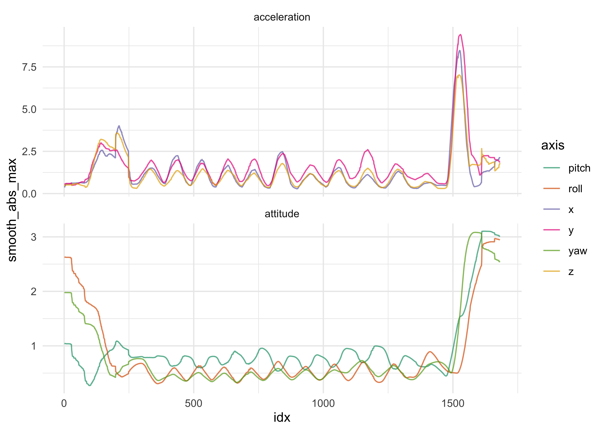
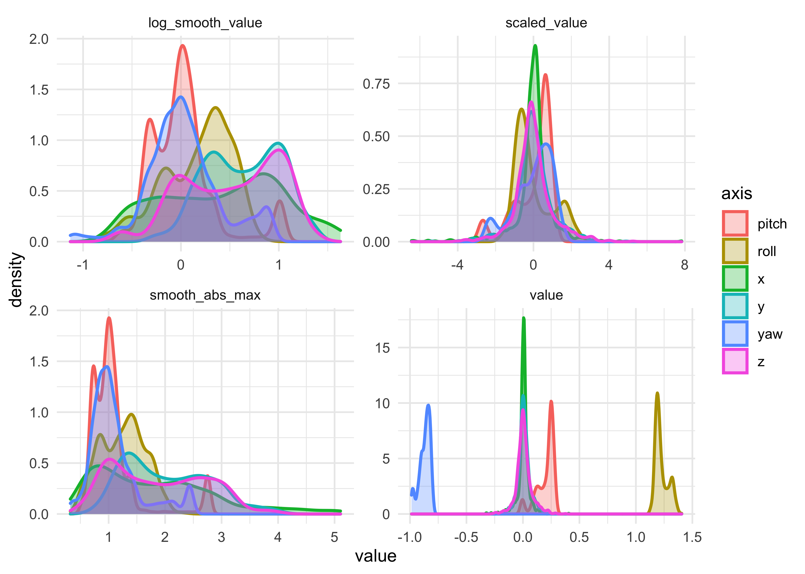
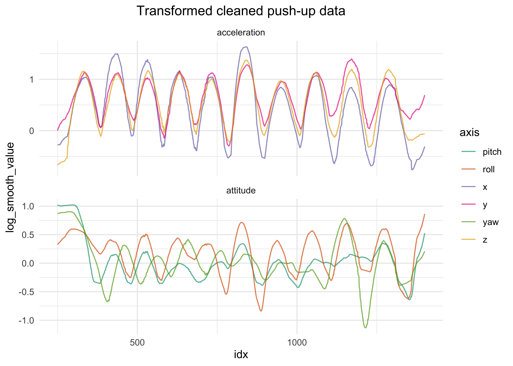
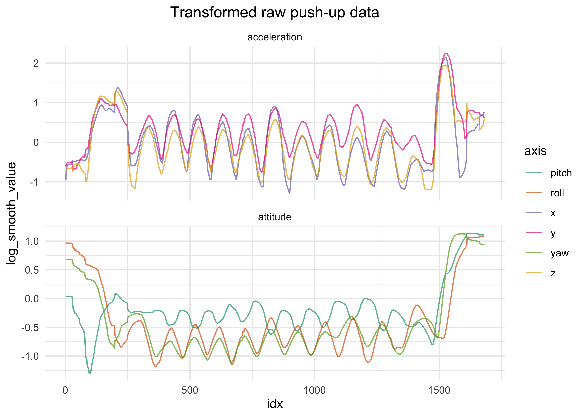
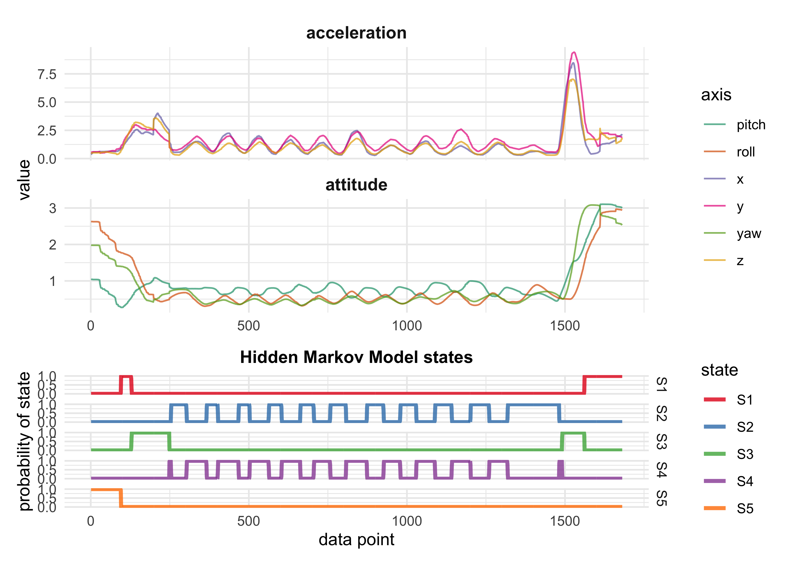
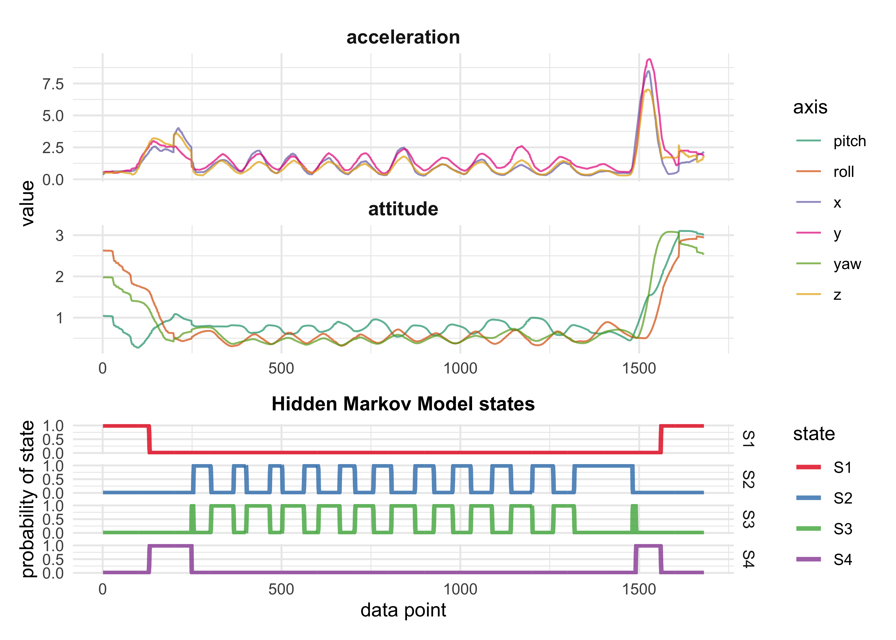
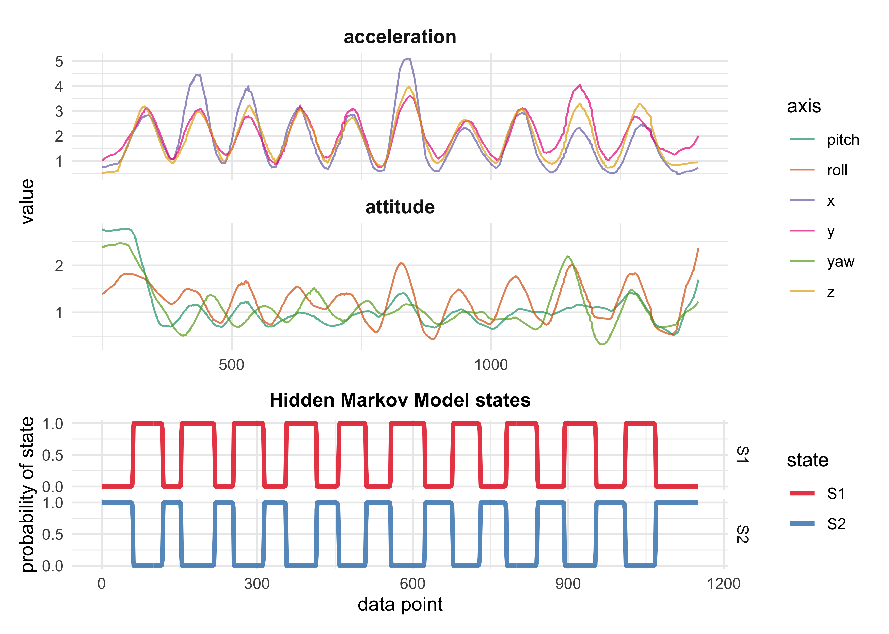

Hidden Markov Modeling
================

Exploratoring the data
======================

Load in some push-up data and explore the numbers.

    all_data_files <- get_data_file_names(data_dir)
    raw_pushup_data <- read_watch_data(all_data_files[2])

    #> Warning: Unknown or uninitialised column: `date`.

    #> Warning: Unknown or uninitialised column: `date`.

    raw_pushup_telemetry_data <- raw_pushup_data$telemetry_data

Plot the data over time.

    line_plot_telemetry <- function(df, x = value) {
      df %>%
        ggplot(aes(idx, {{ x }})) +
        facet_wrap(~ motion, ncol = 1, scales = "free_y") +
        geom_line(aes(color = axis), alpha = 0.7) +
        scale_color_brewer(type = "qual", palette = "Dark2")
    }

    line_plot_telemetry(raw_pushup_telemetry_data)

<!-- -->

Subset just the portions of the data where the push-ups are. This is
some usefuly “clean” data for initial model fitting and testing.

    clean_pushup_data <- raw_pushup_telemetry_data %>%
      filter(between(idx, 250, 1400))
    line_plot_telemetry(clean_pushup_data) +
      theme(
        plot.title = element_text(hjust = 0.5, face = "bold")
      ) +
      labs(title = "Subsetted push-up data")

<!-- -->

Data transformations
--------------------

### Smoothened data

The `ksmooth` function from the ‘stats’ package has 2 kernel methods:
*normal* and *box*.

    clean_pushup_data %.% {
      group_by(axis, motion)
      mutate(smooth_value = ksmooth(date, value, kernel = "normal")$y)
      ungroup()
    } %>%
      line_plot_telemetry(smooth_value)

<!-- -->

    clean_pushup_data %.% {
      group_by(axis, motion)
      mutate(smooth_value = ksmooth(date, value, kernel = "box")$y)
      ungroup()
    } %>%
      line_plot_telemetry(smooth_value)

<!-- -->

In general, smoothing the data seems to have a larger effect on the
acceleration data. Because the acceleration seems to oscillate back and
forth very rapidly, the smoothing just crishes it back towards 0.

    clean_pushup_data %.% {
      group_by(axis, motion)
      mutate(smooth_value = ksmooth(date, value, kernel = "normal")$y)
      ungroup()
      filter(between(idx, 600, 1000))
      pivot_longer(
        -c(date, idx, axis, motion),
        names_to = "transformation",
        values_to = "value"
      )
      filter(motion == "acceleration")
    } %>%
      ggplot(aes(idx, value)) +
      facet_wrap(~ axis, ncol = 1) +
      geom_line(aes(color = axis, alpha = transformation, size = transformation)) +
      scale_color_brewer(type = "qual", palette = "Set1") +
      scale_size_manual(values = c(2, 1)) +
      scale_alpha_manual(values = c(0.7, 0.4))

<!-- -->

Perhaps, a running measure of values could be informative.

    # Performs an action `fxn` on a running basis over `x`.
    running_fxn <- function(x, fxn, n = 5) {
      y <- x
      for (i in seq(1, length(x))) {
        x_i <- c()
        for (j in seq(-n, n)) {
          idx <- i + j
          if (idx < 1 | idx > length(x)) { next }
          x_i <- c(x_i, x[[idx]])
        }
        y[[i]] <- fxn(x_i)
      }
      return(y)
    }

Below are plots of the acceleration data with a few different
transformations. A possible conclusion is that it may not be the actual
acceleration values that matter, but how variable the data is. The
`smooth_abs_max` value looks very promising. It is the smoothened
version of `running_abs_max` which is maximum absolute value on a
running-basis (± 10 positions on either side).

    test_smoothing_trans <- function(df, x = value) {
      df %.% {
        group_by(axis, motion)
        mutate(
          running_var = running_fxn({{ x }}, fxn = var, n = 10),
          running_abs_max = running_fxn(abs({{ x }}), fxn = max, n = 10),
          smooth_abs_value = ksmooth(date, abs({{ x }}), kernel = "box")$y,
          smooth_abs_max = ksmooth(date, running_abs_max, kernel = "box")$y
        )
      }
    }

    clean_pushup_data %.% {
      test_smoothing_trans(value)
      filter(between(idx, 600, 800))
      pivot_longer(
        -c(date, idx, axis, motion),
        names_to = "transformation",
        values_to = "value"
      )
      filter(motion == "acceleration")
    }%>%
      ggplot(aes(idx, value)) +
      facet_grid(axis ~ transformation) +
      geom_line(aes(color = transformation), alpha = 0.8, size= 1.2) +
      scale_color_brewer(type = "qual", palette = "Set2", guide = FALSE) 

<!-- -->

The smoothing method on the cleaned push-up data.

    clean_pushup_data %>%
      test_smoothing_trans(value) %>%
      line_plot_telemetry(smooth_abs_max)

<!-- -->

The smoothing method on the raw push-up data (all of the data, not just
the clipped middle portion).

    raw_pushup_telemetry_data %>% 
      test_smoothing_trans(value) %>%
      line_plot_telemetry(smooth_abs_max)

<!-- -->

    apply_smoothing_trans <- function(df, x = value, rolling_n = 10) {
      df %.% {
        group_by(axis, motion)
        mutate(
          running_abs_max = running_fxn(abs({{ x }}), fxn = max, n = rolling_n),
          smooth_abs_max = ksmooth(date, running_abs_max, kernel = "box")$y
        )
      }
    }

Trying different rolling-window sizes.

    raw_pushup_rolling_ns <- raw_pushup_telemetry_data %>% 
      apply_smoothing_trans(value, rolling_n = 5) %>%
      select(date, idx, axis, motion, value, smooth_abs_max5 = smooth_abs_max) %>%
      apply_smoothing_trans(value, rolling_n = 10) %>%
      select(-running_abs_max) %>%
      rename(smooth_abs_max10 = smooth_abs_max) %>% 
      apply_smoothing_trans(value, rolling_n = 20) %>%
      select(-running_abs_max) %>%
      rename(smooth_abs_max20 = smooth_abs_max) %>% 
      apply_smoothing_trans(value, rolling_n = 40) %>%
      select(-running_abs_max) %>%
      rename(smooth_abs_max40 = smooth_abs_max) %>% 
      apply_smoothing_trans(value, rolling_n = 60) %>%
      select(-running_abs_max) %>%
      rename(smooth_abs_max60 = smooth_abs_max) %>% 
      apply_smoothing_trans(value, rolling_n = 80) %>%
      select(-running_abs_max) %>%
      rename(smooth_abs_max80 = smooth_abs_max) %>% 
      apply_smoothing_trans(value, rolling_n = 100) %>%
      select(-running_abs_max) %>%
      rename(smooth_abs_max100 = smooth_abs_max)

    raw_pushup_rolling_ns %.% {
      rename(value0 = value)
      pivot_longer(-c(date, idx, axis, motion))
      mutate(rolling_n = as.numeric(str_extract(name, "[:digit:]+")))
      filter(motion == "acceleration")
    } %>%
      ggplot(aes(date, value)) +
      facet_wrap(~ axis, ncol = 1, scales = "free") +
      geom_line(aes(color = factor(rolling_n)), size = 0.6, alpha = 0.7) +
      theme(legend.position = "right") +
      labs(x = "time point",
           y = "value",
           color = "rolling-window\nsize")

<!-- -->
A rolling-window of size 10-20 should be good. I’ll leave the default
value at 10.

### Scaled data

    zscale <- function(x, na.rm = TRUE) {
      (x - mean(x, na.rm = na.rm)) / sd(x, na.rm = na.rm)
    }

    clean_pushup_data %.% {
      group_by(axis, motion)
      mutate(
        scaled_value = zscale(value)
      )
      ungroup()
    } %>%
      line_plot_telemetry(scaled_value)

<!-- -->

Applying the smoothing method from above to scaled data.

    clean_pushup_data %.% {
      group_by(axis, motion)
      mutate(
        scaled_value = zscale(value)
      )
      ungroup()
      apply_smoothing_trans(scaled_value)
    } %>%
      line_plot_telemetry(smooth_abs_max)

<!-- -->

The scaled smooth data looks very promising.

    raw_pushup_telemetry_data %.% {
      group_by(axis, motion)
      mutate(
        scaled_value = zscale(value)
      )
      ungroup()
      apply_smoothing_trans(scaled_value)
    } %>%
      line_plot_telemetry(smooth_abs_max)

<!-- -->

    apply_scale_trans <- function(df, x = value) {
      df %.% {
        group_by(axis, motion)
        mutate(scaled_value = zscale({{ x }}))
        ungroup()
      }
    }

### Log-transformation

The log transform could help adjust the data to appear more normal. From
the plots below, the scaled data is pretty normal, though the smoothing
process disrupts that. Taking the logarithm seems to help, though it may
come down to experimenting with the model fitting process.

    clean_pushup_data %.% {
      apply_scale_trans(value)
      apply_smoothing_trans(scaled_value)
      log_smooth_value = log(smooth_abs_max + 0.001)
      
      select(date, idx, axis, value, scaled_value, smooth_abs_max, log_smooth_value)
      pivot_longer(-c(date, idx, axis),
                   names_to = "trans_type",
                   values_to = "value")
    } %>%
      ggplot(aes(value)) +
      facet_wrap(~ trans_type, scales = "free", ncol = 2) +
      geom_density(aes(color = axis, fill = axis), size = 0.9, alpha = 0.3)

<!-- -->

### A single function for applying all data transforms

    apply_data_transforms <- function(df, x = value, rolling_n = 10) {
      df %.% {
        apply_scale_trans({{ x }})
        apply_smoothing_trans(scaled_value, rolling_n = rolling_n)
        log_smooth_value = log(smooth_abs_max + 0.0001)
      }
    }

Exploration of Hidden Markov Models (HMM)
-----------------------------------------

Fit 3 different types of models: one with all of the data, one with just
the acceleration data, and one with just the attitude data.

    pivot_telemetry_data <- function(telemetry_data, x = value) {
      telemetry_data %>%
        pivot_wider(
          c(date, idx),
          names_from = axis,
          values_from = {{ x }}
        )
    }

    construct_full_telemetry_hmm_model <- function(d, nstates) {
      depmix(
        list(
          x ~ 1,
          y ~ 1,
          z ~ 1,
          pitch ~ 1,
          roll ~ 1,
          yaw ~ 1
        ),
        nstates = nstates,
        family = list(
          gaussian(), gaussian(), gaussian(),
          gaussian(), gaussian(), gaussian()
        ),
        data = d
      )
    }

    construct_accel_telemetry_hmm_model <- function(d, nstates) {
      depmix(
        list(
          x ~ 1,
          y ~ 1,
          z ~ 1
        ),
        nstates = nstates,
        family = list(gaussian(), gaussian(), gaussian()),
        data = d
      )
    }

    construct_attitude_telemetry_hmm_model <- function(d, nstates) {
      depmix(
        list(
          pitch ~ 1,
          roll ~ 1,
          yaw ~ 1
        ),
        nstates = nstates,
        family = list(gaussian(), gaussian(), gaussian()),
        data = d
      )
    }

    pushup_data_wide <- pivot_telemetry_data(clean_pushup_data)

    hmm_construction_functions <- c(
      "full" = construct_full_telemetry_hmm_model,
      "accel_only" = construct_accel_telemetry_hmm_model,
      "attitude_only" = construct_attitude_telemetry_hmm_model
    )

    hmm_cleaned_models <- tibble(
      nstates = rep(c(2, 3), 3),
      fxn_name = rep(names(hmm_construction_functions), each= 2),
      fxn = rep(hmm_construction_functions, each = 2)
    ) %>%
      mutate(
        model = map2(fxn, nstates, ~ .x(d = pushup_data_wide, nstates = .y)),
        fit = map(model, fit),
        aic = map_dbl(fit, AIC),
        bic = map_dbl(fit, BIC)
      )

    #> converged at iteration 12 with logLik: 12458.72 
    #> converged at iteration 20 with logLik: 13035.3 
    #> converged at iteration 12 with logLik: 6089.985 
    #> converged at iteration 80 with logLik: 6319.58 
    #> converged at iteration 16 with logLik: 7182.697 
    #> converged at iteration 35 with logLik: 7631.297

    hmm_cleaned_models %>%
      arrange(aic, bic)

    #> # A tibble: 6 x 7
    #>   nstates fxn_name      fxn          model        fit              aic     bic
    #>     <dbl> <chr>         <named list> <named list> <named list>   <dbl>   <dbl>
    #> 1       3 full          <fn>         <depmix>     <dpmx.ftt>   -25983. -25760.
    #> 2       2 full          <fn>         <depmix>     <dpmx.ftt>   -24863. -24727.
    #> 3       3 attitude_only <fn>         <depmix>     <dpmx.ftt>   -15211. -15079.
    #> 4       2 attitude_only <fn>         <depmix>     <dpmx.ftt>   -14335. -14260.
    #> 5       3 accel_only    <fn>         <depmix>     <dpmx.ftt>   -12587. -12456.
    #> 6       2 accel_only    <fn>         <depmix>     <dpmx.ftt>   -12150. -12074.

    plot_hmm_results <- function(hmm_fit) {
      posterior(hmm_fit) %>%
        as_tibble() %>%
        mutate(idx = row_number()) %>%
        pivot_longer(-c(idx, state)) %>%
        ggplot(aes(x = idx, y = value, color = name)) +
        facet_grid(name ~ .) +
        geom_line(size = 1.2, alpha = 0.8) +
        scale_color_brewer(type = "qual", palette = "Set1") +
        scale_y_continuous(breaks = c(0, 0.5, 1)) +
        theme(
          plot.title = element_text(hjust = 0.5, size = 11, face = "bold"),
        ) +
        labs(
          x = "data point",
          y = "probability of state",
          color = "state",
          title = "Hidden Markov Model states"
        )
    }

    data_and_hmm_plot <- function(model_data, hmm_fit, x = value) {
      data_p <- model_data %>%
        mutate(motion_type = str_to_title(axis)) %>%
        line_plot_telemetry(x = {{ x }}) +
        labs(
          x = NULL,
          y = "value"
        ) +
        theme(
          strip.text = element_text(size = 11, face = "bold")
        )

      hmm_p <- plot_hmm_results(hmm_fit)

      data_p / hmm_p
    }

    get_best_model <- function(model_df) {
      model_df$fit[which.min(model_df$aic)][[1]]
    }

    best_cleaned_model <- get_best_model(hmm_cleaned_models)
    summary(best_cleaned_model)

    #> Initial state probabilities model 
    #> pr1 pr2 pr3 
    #>   1   0   0 
    #> 
    #> Transition matrix 
    #>         toS1  toS2  toS3
    #> fromS1 0.933 0.000 0.067
    #> fromS2 0.015 0.985 0.000
    #> fromS3 0.008 0.036 0.956
    #> 
    #> Response parameters 
    #> Resp 1 : gaussian 
    #> Resp 2 : gaussian 
    #> Resp 3 : gaussian 
    #> Resp 4 : gaussian 
    #> Resp 5 : gaussian 
    #> Resp 6 : gaussian 
    #>     Re1.(Intercept) Re1.sd Re2.(Intercept) Re2.sd Re3.(Intercept) Re3.sd
    #> St1           0.008  0.019          -0.010  0.037          -0.015  0.027
    #> St2           0.007  0.026           0.002  0.040           0.000  0.047
    #> St3          -0.007  0.094           0.036  0.088           0.046  0.111
    #>     Re4.(Intercept) Re4.sd Re5.(Intercept) Re5.sd Re6.(Intercept) Re6.sd
    #> St1           0.113  0.092           1.287  0.038          -0.933  0.042
    #> St2           0.253  0.018           1.192  0.019          -0.841  0.024
    #> St3           0.140  0.047           1.269  0.065          -0.889  0.037

    data_and_hmm_plot(clean_pushup_data, best_cleaned_model) +
      plot_layout(heights = c(2, 1))

<!-- -->

    raw_pushup_wide <- pivot_telemetry_data(raw_pushup_telemetry_data)

    hmm_raw_models <- tibble(
      nstates = c(2:5),
      fxn = rep(c(construct_full_telemetry_hmm_model), 4)
    ) %>%
      mutate(
        model = map2(fxn, nstates, ~ .x(d = raw_pushup_wide, nstates = .y)),
        fit = map(model, fit),
        aic = map_dbl(fit, AIC),
        bic = map_dbl(fit, BIC)
      )

    #> converged at iteration 12 with logLik: 10434.93 
    #> converged at iteration 26 with logLik: 11573.8 
    #> converged at iteration 20 with logLik: 14354.5 
    #> converged at iteration 113 with logLik: 15119.44

    hmm_raw_models

    #> # A tibble: 4 x 6
    #>   nstates fxn    model    fit            aic     bic
    #>     <int> <list> <list>   <list>       <dbl>   <dbl>
    #> 1       2 <fn>   <depmix> <dpmx.ftt> -20816. -20669.
    #> 2       3 <fn>   <depmix> <dpmx.ftt> -23060. -22821.
    #> 3       4 <fn>   <depmix> <dpmx.ftt> -28583. -28241.
    #> 4       5 <fn>   <depmix> <dpmx.ftt> -30071. -29615.

    best_raw_model <- get_best_model(hmm_raw_models)
    summary(best_raw_model)

    #> Initial state probabilities model 
    #> pr1 pr2 pr3 pr4 pr5 
    #>   0   1   0   0   0 
    #> 
    #> Transition matrix 
    #>         toS1  toS2  toS3  toS4  toS5
    #> fromS1 0.983 0.000 0.017 0.000 0.000
    #> fromS2 0.000 0.996 0.000 0.000 0.004
    #> fromS3 0.026 0.000 0.963 0.007 0.004
    #> fromS4 0.000 0.000 0.020 0.980 0.000
    #> fromS5 0.000 0.007 0.014 0.000 0.979
    #> 
    #> Response parameters 
    #> Resp 1 : gaussian 
    #> Resp 2 : gaussian 
    #> Resp 3 : gaussian 
    #> Resp 4 : gaussian 
    #> Resp 5 : gaussian 
    #> Resp 6 : gaussian 
    #>     Re1.(Intercept) Re1.sd Re2.(Intercept) Re2.sd Re3.(Intercept) Re3.sd
    #> St1           0.007  0.026           0.003  0.039           0.000  0.046
    #> St2           0.023  0.066          -0.016  0.062           0.069  0.117
    #> St3           0.002  0.077           0.010  0.085           0.006  0.122
    #> St4           0.002  0.023           0.001  0.033           0.003  0.025
    #> St5           0.175  0.282           0.005  0.230           0.073  0.440
    #>     Re4.(Intercept) Re4.sd Re5.(Intercept) Re5.sd Re6.(Intercept) Re6.sd
    #> St1           0.252  0.019           1.192  0.019          -0.842  0.025
    #> St2          -0.145  0.204           0.127  0.197           0.041  0.225
    #> St3           0.135  0.058           1.273  0.060          -0.893  0.038
    #> St4           0.010  0.021           1.309  0.051          -0.961  0.017
    #> St5           0.004  0.138           0.978  0.309          -0.450  0.404

    data_and_hmm_plot(raw_pushup_telemetry_data, best_raw_model) +
      plot_layout(heights = c(2, 1))

<!-- -->

### Fitting with transformed data

    clean_trans_pushups <- clean_pushup_data %>% 
      apply_data_transforms(value)

    raw_trans_pushups <- raw_pushup_telemetry_data %>% 
      apply_data_transforms(value)

    clean_trans_pushups %>%
      line_plot_telemetry(log_smooth_value) +
      theme(plot.title = element_text(hjust = 0.5)) +
      labs(title = "Transformed cleaned push-up data")

<!-- -->

    raw_trans_pushups %>%
      line_plot_telemetry(log_smooth_value) +
      theme(plot.title = element_text(hjust = 0.5)) +
      labs(title = "Transformed raw push-up data")

<!-- -->

    raw_pushup_wide <- pivot_telemetry_data(raw_trans_pushups, 
                                            x = smooth_abs_max)

    hmm_raw_models <- tibble(
      nstates = c(2:5),
      fxn = rep(c(construct_full_telemetry_hmm_model), 4)
    ) %>%
      mutate(
        model = map2(fxn, nstates, ~ .x(d = raw_pushup_wide, nstates = .y)),
        fit = map(model, fit),
        aic = map_dbl(fit, AIC),
        bic = map_dbl(fit, BIC)
      )

    #> converged at iteration 12 with logLik: -9313.942 
    #> converged at iteration 25 with logLik: -1518.062 
    #> converged at iteration 33 with logLik: -88.66864 
    #> converged at iteration 31 with logLik: 983.0463

    hmm_raw_models %>%
      arrange(aic, bic)

    #> # A tibble: 4 x 6
    #>   nstates fxn    model    fit           aic    bic
    #>     <int> <list> <list>   <list>      <dbl>  <dbl>
    #> 1       5 <fn>   <depmix> <dpmx.ftt> -1798. -1342.
    #> 2       4 <fn>   <depmix> <dpmx.ftt>   303.   645.
    #> 3       3 <fn>   <depmix> <dpmx.ftt>  3124.  3363.
    #> 4       2 <fn>   <depmix> <dpmx.ftt> 18682. 18828.

    data_and_hmm_plot(raw_trans_pushups,
                      get_best_model(hmm_raw_models),
                      x = smooth_abs_max) +
      plot_layout(heights = c(2, 1))

<!-- -->

    data_and_hmm_plot(raw_trans_pushups,  
                      hmm_raw_models$fit[hmm_raw_models$nstates == 4][[1]],
                      x = smooth_abs_max) +
      plot_layout(heights = c(2, 1))

<!-- -->

    clean_pushup_wide <- pivot_telemetry_data(clean_trans_pushups, 
                                              x = smooth_abs_max)

    hmm_clean_models <- tibble(
      nstates = c(2:7),
      fxn = rep(c(construct_full_telemetry_hmm_model), length(2:7))
    ) %>%
      mutate(
        model = map2(fxn, nstates, ~ .x(d = clean_pushup_wide, nstates = .y)),
        fit = map(model, fit),
        aic = map_dbl(fit, AIC),
        bic = map_dbl(fit, BIC)
      )

    #> converged at iteration 31 with logLik: -3940.265 
    #> converged at iteration 28 with logLik: -2448.433 
    #> converged at iteration 40 with logLik: -1503.109 
    #> converged at iteration 41 with logLik: -929.7958 
    #> converged at iteration 56 with logLik: -574.581 
    #> converged at iteration 76 with logLik: 97.29697

    hmm_clean_models %>%
      arrange(aic, bic)

    #> # A tibble: 6 x 6
    #>   nstates fxn    model    fit           aic   bic
    #>     <int> <list> <list>   <list>      <dbl> <dbl>
    #> 1       7 <fn>   <depmix> <dpmx.ftt>   69.4  736.
    #> 2       6 <fn>   <depmix> <dpmx.ftt> 1363.  1903.
    #> 3       5 <fn>   <depmix> <dpmx.ftt> 2028.  2452.
    #> 4       4 <fn>   <depmix> <dpmx.ftt> 3132.  3450.
    #> 5       3 <fn>   <depmix> <dpmx.ftt> 4985.  5207.
    #> 6       2 <fn>   <depmix> <dpmx.ftt> 7935.  8071.

    data_and_hmm_plot(clean_trans_pushups,  
                      hmm_clean_models$fit[hmm_clean_models$nstates == 2][[1]],
                      x = smooth_abs_max) +
      plot_layout(heights = c(2, 1))

<!-- -->

The smoothed data seems to work the best. I think applying the
log-transform squishes too many of the distinguishing features out of
the data.

------------------------------------------------------------------------

Conclusions
-----------

1.  Smoothing and scaling the data seems to help, though a
    log-transformation squishes the data more than desired.
2.  An HMM can identify the states of a push-up, though it has
    difficulty with the data from before and after the push-ups begin.
