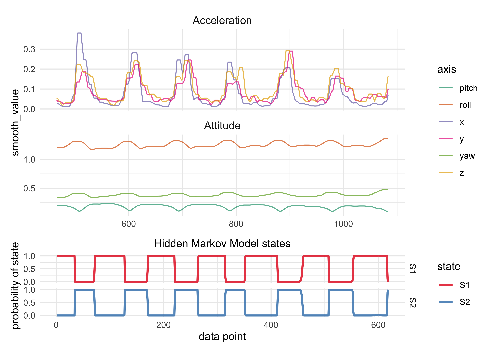
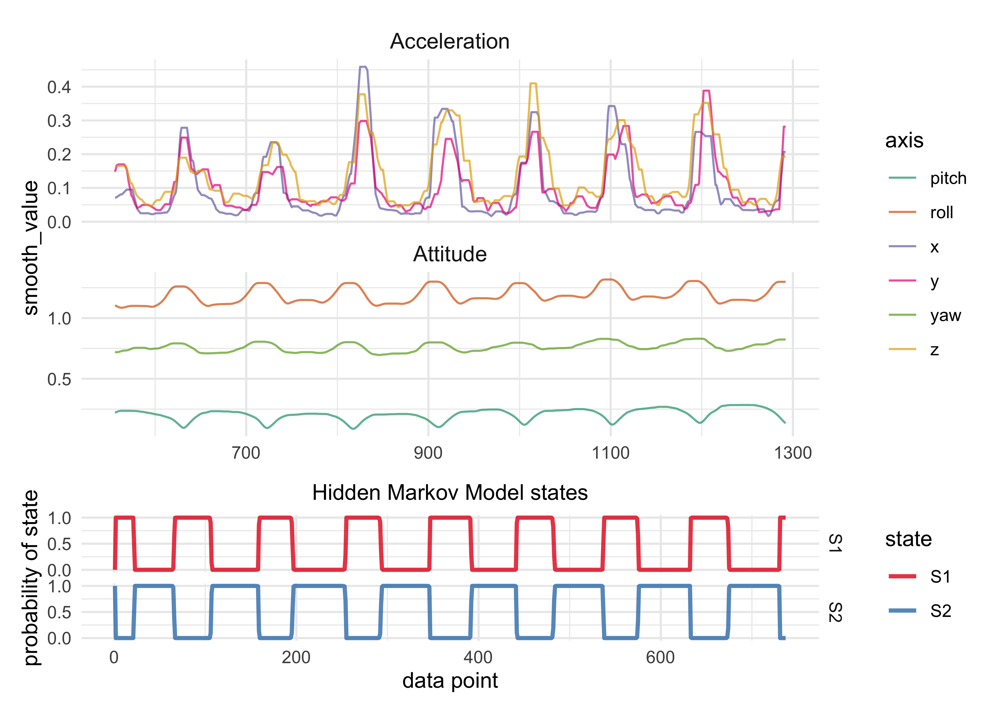
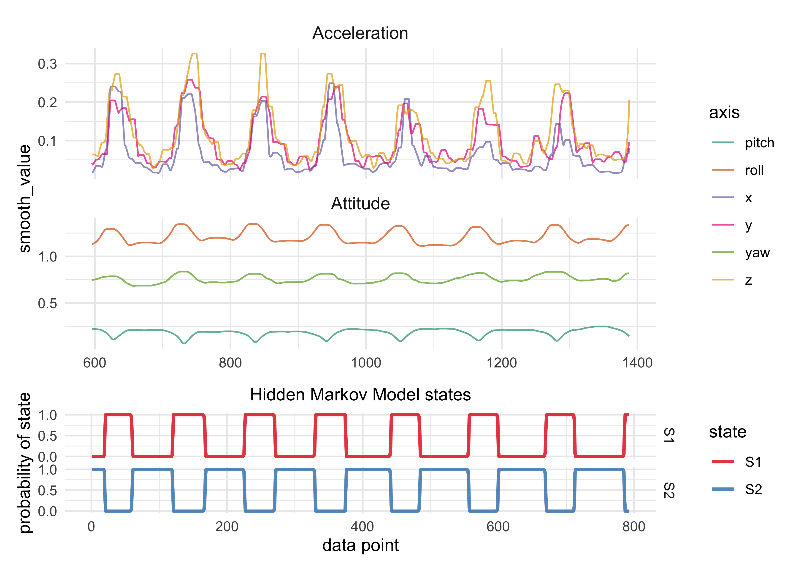

Hidden Markov Model-based learning pipelines
================

Below, I try out a few HMM-based modeling and prediciton pipelines.

Data
----

    zscale <- function(x, na.rm = TRUE) {
      (x - mean(x, na.rm = na.rm)) / sd(x, na.rm = na.rm)
    }

    apply_scale_trans <- function(df, x = value, y = scaled_value) {
      df %.% {
        group_by(axis, motion)
        mutate({{ y }} := zscale({{ x }}))
        ungroup()
      }
    }

    running_fxn <- function(x, fxn, n = 5) {
      y <- x
      for (i in seq(1, length(x))) {
        x_i <- c()
        for (j in seq(-n, n)) {
          idx <- i + j
          if (idx < 1 | idx > length(x)) { next }
          x_i <- c(x_i, x[[idx]])
        }
        y[[i]] <- fxn(x_i)
      }
      return(y)
    }

    apply_smoothing_trans <- function(df, 
                                      x = value, 
                                      y = smooth_value, 
                                      rolling_n = 10) {
      df %.% {
        group_by(axis, motion)
        mutate(
          {{ y }} := running_fxn(abs({{ x }}), fxn = max, n = rolling_n),
          {{ y }} := ksmooth(date, {{ y }}, kernel = "box")$y
        )
      }
    }

    transform_pushup_data <- function(df) {
      df %>%
        apply_scale_trans() %>%
        apply_smoothing_trans(x = scaled_value)
    }

    pushup_data <- tibble(filename = get_data_file_names(data_dir)) %.% {
      filter(str_detect(filename, "Push"))
      mutate(
        workout_idx = row_number(),
        all_data = map(filename, read_watch_data),
        file_info = map(all_data, ~ .x$meta_data),
        data = map(all_data, ~ .x$telemetry_data),
        data = map(data, transform_pushup_data),
        data = map(data, ~ rename(.x, time_step = date)),
        data = map(data, ~ select(.x,
          time_step, idx, motion, axis, value, scaled_value, smooth_value
        ))
      )
      select(-all_data, -filename)
      unnest(file_info)
      select(workout_idx, exercise, reps, date, data)
    }

    pushup_data

    #> # A tibble: 5 x 5
    #>   workout_idx exercise reps  date                data                 
    #>         <int> <chr>    <chr> <dttm>              <list>               
    #> 1           1 Push-Ups 10    2020-10-03 17:43:59 <tibble [10,086 × 7]>
    #> 2           2 Push-Ups 10    2020-10-04 13:24:29 <tibble [9,288 × 7]> 
    #> 3           3 Push-Ups 10    2020-10-04 13:25:57 <tibble [11,082 × 7]>
    #> 4           4 Push-Ups 10    2020-10-05 12:36:09 <tibble [10,596 × 7]>
    #> 5           5 Push-Ups 10    2020-10-05 12:36:49 <tibble [11,898 × 7]>

Pipeline \#1. Heuristic chop & simple HMM
-----------------------------------------

### Overview

**Pipeline**

1.  Chop the raw data within an IQR of the time steps to get just the
    clena pushup data.
2.  Use an HMM to identify the 2 states of the push-up.
3.  Use the HMM to cut the chopped data into the two states of training
    a classifier.
4.  Train an classifier on this training data.
5.  Apply the classifier to the original data to test accuracy.

**Experimental features**

1.  The type of classifier to use.
2.  Would it be possible to train the classifer with *3* classes, one
    being “unknown” and having this be the very beginning and ending
    data?

### Pipeline

#### 1. Chop the data

Select only the time steps in the 30 and 70 percentiles.

    chopped_pushup_data <- pushup_data %.% {
      unnest(data)
      group_by(workout_idx)
      filter(time_step > quantile(time_step, 0.3) & time_step < quantile(time_step, 0.7))
      ungroup()
    }

    # Number of data points per workout.
    chopped_pushup_data %>%
      group_by(workout_idx) %>%
      summarise(n_datapoints = n_distinct(idx)) %>%
      ungroup()

    #> # A tibble: 5 x 2
    #>   workout_idx n_datapoints
    #>         <int>        <int>
    #> 1           1          671
    #> 2           2          618
    #> 3           3          737
    #> 4           4          706
    #> 5           5          793

    chopped_pushup_data %>%
      ggplot(aes(x = time_step, y = smooth_value)) +
      facet_wrap(~ workout_idx, scales = "free", ncol = 2) +
      geom_line(aes(color = axis))

<!-- -->

#### 2. Train HMM

    nest_pushup_exercises <- function(df) {
      df %>%
        group_by(workout_idx, exercise, reps, date) %>%
        nest() %>%
        ungroup()
    }

    pivot_telemetry_data <- function(telemetry_data, x = value) {
      telemetry_data %>%
        pivot_wider(
          c(time_step, idx),
          names_from = axis,
          values_from = {{ x }}
        )
    }

    construct_pushup_hmm <- function(d, nstates = 2) {
      depmix(
        list(
          x ~ 1,
          y ~ 1,
          z ~ 1,
          pitch ~ 1,
          roll ~ 1,
          yaw ~ 1
        ),
        nstates = nstates,
        family = list(
          gaussian(), gaussian(), gaussian(),
          gaussian(), gaussian(), gaussian()
        ),
        data = d
      )
    }

    chopped_pushup_hmms <- chopped_pushup_data %.% {
      nest_pushup_exercises()
      mutate(
        wide_data = map(data, pivot_telemetry_data, x = smooth_value),
        model = map(wide_data, construct_pushup_hmm),
        fit = map(model, fit)
      )
    }

    #> converged at iteration 35 with logLik: 2013.841 
    #> converged at iteration 33 with logLik: 3412.07 
    #> converged at iteration 31 with logLik: 1992.361 
    #> converged at iteration 32 with logLik: 3452.777 
    #> converged at iteration 55 with logLik: 3122.072

    plot_telmetry_data <- function(df, x = value) {
      df %>%
        mutate(motion = str_to_title(motion)) %>%
        ggplot(aes(idx, {{ x }})) +
        facet_wrap(~ motion, ncol = 1, scales = "free_y") +
        geom_line(aes(color = axis), alpha = 0.7) +
        scale_color_brewer(type = "qual", palette = "Dark2") +
        theme(
          strip.text = element_text(hjust = 0.5, size = 11)
        )
    }

    plot_hmm_results <- function(hmm_fit) {
      posterior(hmm_fit) %>%
        as_tibble() %>%
        mutate(idx = row_number()) %>%
        pivot_longer(-c(idx, state)) %>%
        ggplot(aes(x = idx, y = value, color = name)) +
        facet_grid(name ~ .) +
        geom_line(size = 1, alpha = 0.8) +
        scale_color_brewer(type = "qual", palette = "Set1") +
        scale_y_continuous(breaks = c(0, 0.5, 1)) +
        theme(
          plot.title = element_text(hjust = 0.5, size = 11),
        ) +
        labs(
          x = "data point",
          y = "probability of state",
          color = "state",
          title = "Hidden Markov Model states"
        )
    }

    plot_hmm_fit <- function(data, hmm_fit, data_x) {
      data_plot <- plot_telmetry_data(data, x = {{ data_x }}) +
        theme(axis.title.x = element_blank())
      hmm_plot <- plot_hmm_results(hmm_fit)
      patch <- data_plot / hmm_plot + plot_layout(heights = c(3, 1))
      plot(patch)
      return(NULL)
    }

    chopped_pushup_hmms %>%
      mutate(a = walk2(data, fit, plot_hmm_fit, data_x = smooth_value))

<!-- --><!-- --><!-- --><!-- --><!-- -->

    #> # A tibble: 5 x 9
    #>   workout_idx exercise reps  date                data  wide_data model fit  
    #>         <int> <chr>    <chr> <dttm>              <lis> <list>    <lis> <lis>
    #> 1           1 Push-Ups 10    2020-10-03 17:43:59 <tib… <tibble … <dep… <dpm…
    #> 2           2 Push-Ups 10    2020-10-04 13:24:29 <tib… <tibble … <dep… <dpm…
    #> 3           3 Push-Ups 10    2020-10-04 13:25:57 <tib… <tibble … <dep… <dpm…
    #> 4           4 Push-Ups 10    2020-10-05 12:36:09 <tib… <tibble … <dep… <dpm…
    #> 5           5 Push-Ups 10    2020-10-05 12:36:49 <tib… <tibble … <dep… <dpm…
    #> # … with 1 more variable: a <list>

#### 3. Prepare training data with the HMM

    hmm <- chopped_pushup_hmms$fit[[1]]
    d <- chopped_pushup_hmms$wide_data[[1]]
    summary(hmm)

    #> Initial state probabilities model 
    #> pr1 pr2 
    #>   0   1 
    #> 
    #> Transition matrix 
    #>         toS1  toS2
    #> fromS1 0.980 0.020
    #> fromS2 0.017 0.983
    #> 
    #> Response parameters 
    #> Resp 1 : gaussian 
    #> Resp 2 : gaussian 
    #> Resp 3 : gaussian 
    #> Resp 4 : gaussian 
    #> Resp 5 : gaussian 
    #> Resp 6 : gaussian 
    #>     Re1.(Intercept) Re1.sd Re2.(Intercept) Re2.sd Re3.(Intercept) Re3.sd
    #> St1           0.547  0.174           0.910  0.259           0.588  0.158
    #> St2           1.369  0.421           1.734  0.370           1.177  0.236
    #>     Re4.(Intercept) Re4.sd Re5.(Intercept) Re5.sd Re6.(Intercept) Re6.sd
    #> St1           0.821  0.085           0.438  0.067           0.442  0.088
    #> St2           0.686  0.091           0.572  0.078           0.514  0.080

    training_data_1 <- posterior(hmm) %>%
      bind_cols(d) %>%
      mutate(state = case_when(
        S1 > 0.95 ~ "state1",
        S2 > 0.95 ~ "state2",
        TRUE ~ "unknown"
      ))

    training_data_2 <- pushup_data %.% {
      slice(1)
      unnest(data)
      filter(time_step < quantile(time_step, 0.1) | time_step > quantile(time_step, 0.9))
      pivot_telemetry_data(x = smooth_value)
      add_column(state = "unknown")
    }

    training_data <- bind_rows(training_data_1, training_data_2)
    training_data

    #>    state           S1        S2 time_step idx        x        y         z
    #> 1 state2 0.000000e+00 1.0000000  5.065272 506 1.255308 1.122858 0.8085634
    #> 2 state2 2.049341e-07 0.9999998  5.076032 507 1.305323 1.154684 0.8373105
    #> 3 state2 6.062606e-09 1.0000000  5.084931 508 1.377065 1.200807 0.8782624
    #> 4 state2 4.728051e-10 1.0000000  5.095208 509 1.428101 1.233282 0.9075962
    #> 5 state2 3.433873e-11 1.0000000  5.105285 510 1.479137 1.265757 0.9369300
    #> 6 state2 2.318305e-12 1.0000000  5.115360 511 1.530173 1.298233 0.9662638
    #> 7 state2 1.992395e-13 1.0000000  5.125313 512 1.571616 1.330708 0.9955976
    #> 8 state2 2.359157e-14 1.0000000  5.135782 513 1.601343 1.366010 1.0249314
    #> 9 state2 4.271181e-15 1.0000000  5.145336 514 1.628648 1.387252 1.0402729
    #>       pitch       yaw      roll
    #> 1 0.6414071 0.4838070 0.5596884
    #> 2 0.6342582 0.4867968 0.5667852
    #> 3 0.6248701 0.4919223 0.5782134
    #> 4 0.6197661 0.4946057 0.5851250
    #> 5 0.6157154 0.4971909 0.5917577
    #> 6 0.6124956 0.4995942 0.5980708
    #> 7 0.6099608 0.5017864 0.6040403
    #> 8 0.6080596 0.5037295 0.6096021
    #> 9 0.6042039 0.5055054 0.6149831
    #>  [ reached 'max' / getOption("max.print") -- omitted 998 rows ]

**To-Do**:

-   continue with the practice sample started above:
    -   look into using TidyModels for the following analysis
    -   split the data into training and testing data
    -   fit a few different classifiers with this training data and see
        how well they do
        -   decision forest, decision tree, kNN, SVM
