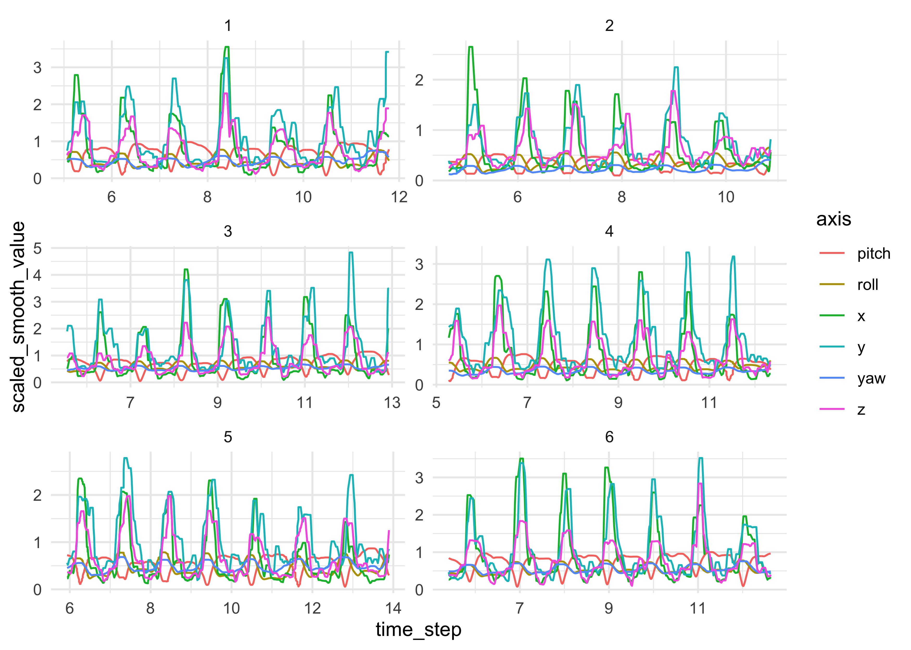
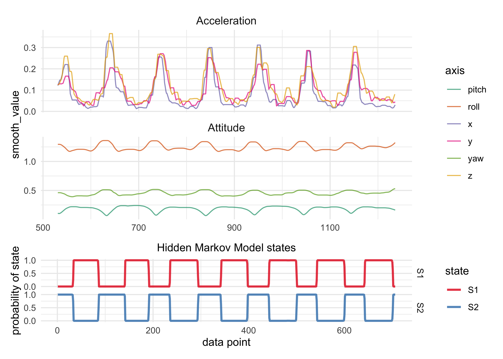
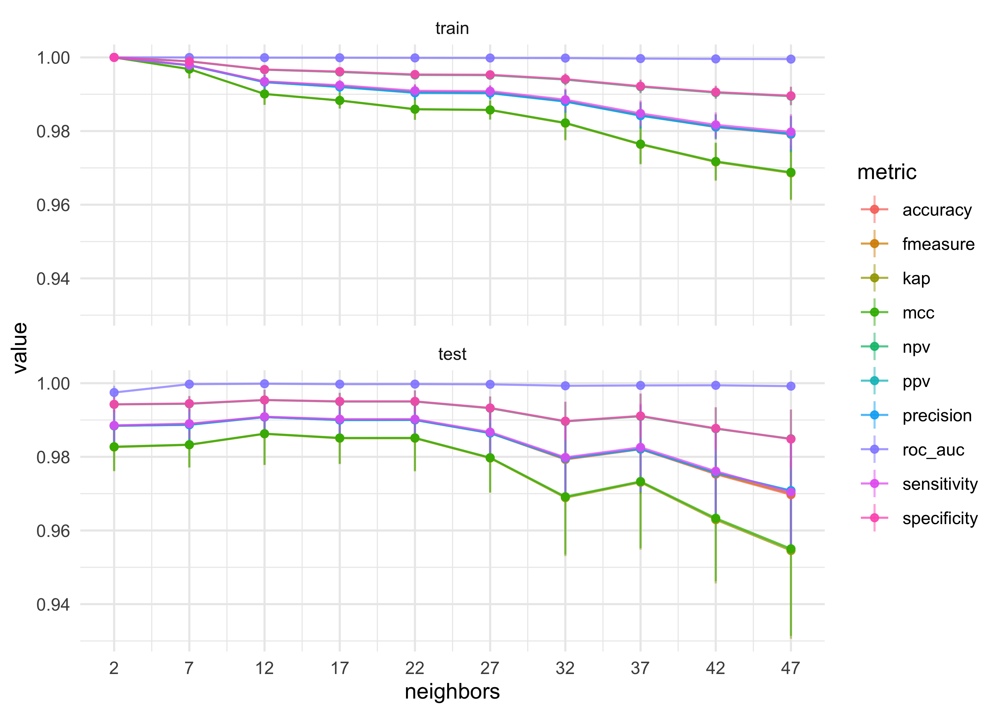
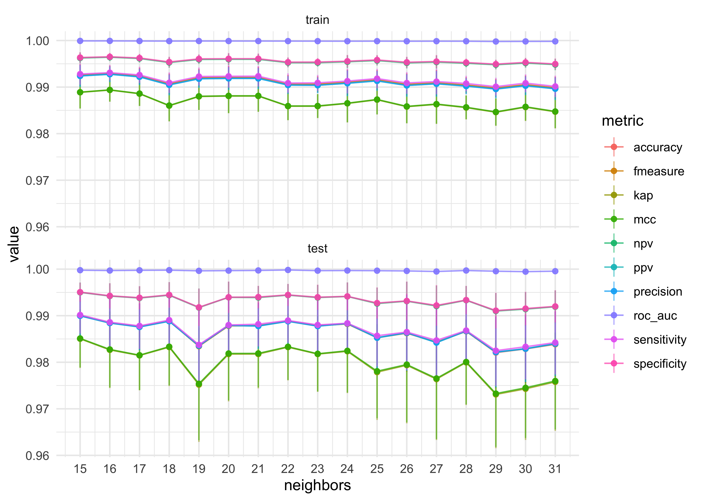
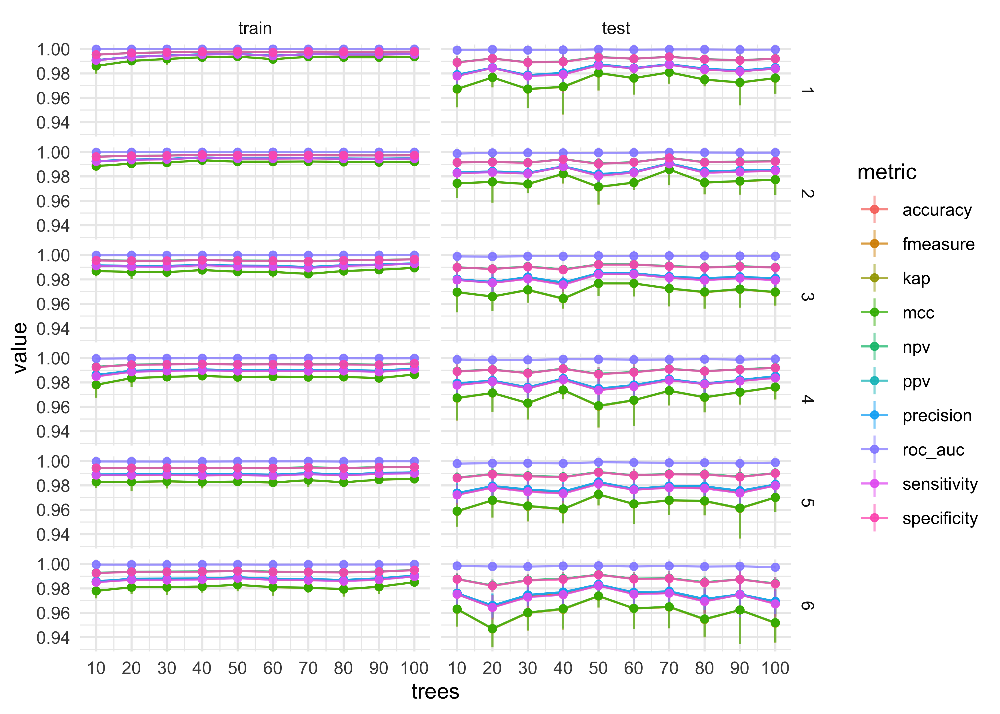
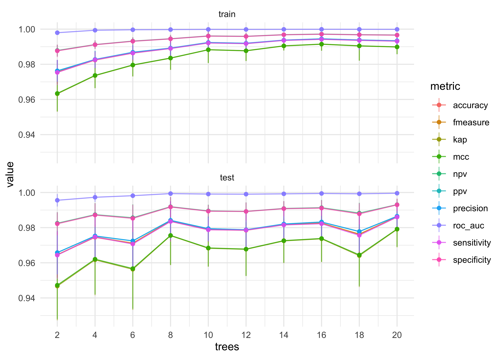
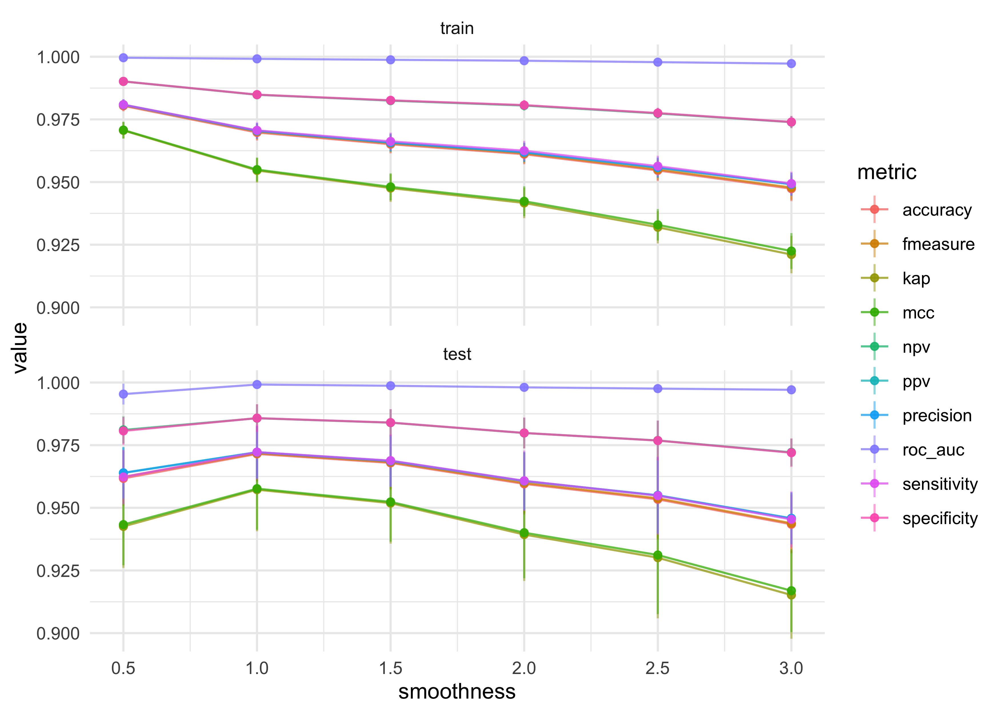
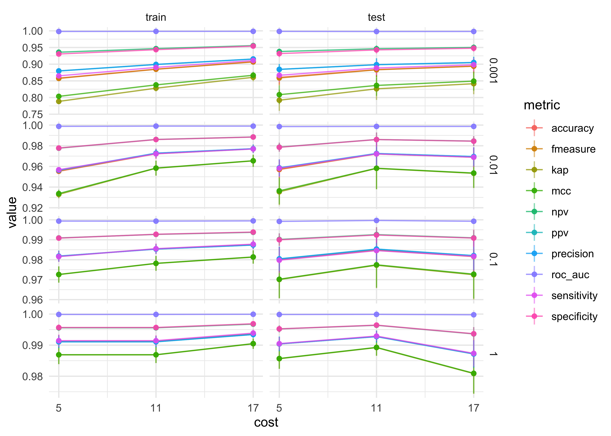

Hidden Markov Model-based learning pipelines
================

Below, I try out a few HMM-based modeling and prediciton pipelines.

Data
----

    zscale <- function(x, na.rm = TRUE) {
      (x - mean(x, na.rm = na.rm)) / sd(x, na.rm = na.rm)
    }

    apply_scale_trans <- function(df, x = value, y = scaled_value) {
      df %.% {
        group_by(axis, motion)
        mutate({{ y }} := zscale({{ x }}))
        ungroup()
      }
    }

    apply_smoothing_trans <- function(df,
                                      x = value,
                                      y = smooth_value,
                                      rolling_n = 10) {
      
      before_after = round(rolling_n / 2)
      
      df %.% {
        group_by(axis, motion)
        mutate(
          {{ y }} := slider::slide_dbl(
            {{ x }}, 
            .f = ~ max(abs(.x)), 
            .before = before_after, 
            .after = before_after
          ),
          {{ y }} := slider::slide_dbl(
            {{ y }},
            .f = mean,
            .before = 2,
            .after = 2
          )
        )
      }
    }

    transform_pushup_data <- function(df) {
      df %>%
        apply_scale_trans() %>%
        apply_smoothing_trans(x = scaled_value)
    }

    pushup_data <- tibble(filename = get_data_file_names(data_dir)) %.% {
      filter(str_detect(filename, "Push"))
      mutate(
        workout_idx = row_number(),
        all_data = map(filename, read_watch_data),
        file_info = map(all_data, ~ .x$meta_data),
        data = map(all_data, ~ .x$telemetry_data),
        data = map(data, transform_pushup_data),
        data = map(data, ~ rename(.x, time_step = date)),
        data = map(data, ~ select(
          .x,
          time_step, idx, motion, axis, value, scaled_value, smooth_value
        ))
      )
      select(-all_data, -filename)
      unnest(file_info)
      select(workout_idx, exercise, reps, date, data)
    }

    pushup_data

    #> # A tibble: 5 x 5
    #>   workout_idx exercise reps  date                data                 
    #>         <int> <chr>    <chr> <dttm>              <list>               
    #> 1           1 Push-Ups 10    2020-10-03 17:43:59 <tibble [10,086 × 7]>
    #> 2           2 Push-Ups 10    2020-10-04 13:24:29 <tibble [9,288 × 7]> 
    #> 3           3 Push-Ups 10    2020-10-04 13:25:57 <tibble [11,082 × 7]>
    #> 4           4 Push-Ups 10    2020-10-05 12:36:09 <tibble [10,596 × 7]>
    #> 5           5 Push-Ups 10    2020-10-05 12:36:49 <tibble [11,898 × 7]>

Pipeline \#1. Heuristic chop & simple HMM
-----------------------------------------

### Overview

**Pipeline**

1.  Chop the raw data within an IQR of the time steps to get just the
    clean push-up data.
2.  Use an HMM to identify the 2 states of the push-up.
3.  Use the HMM to cut the chopped data into the 3 states of a push-up
    (one state as `unknown`).
4.  Train an classifier on this training data.
5.  Apply the classifier to the original data to test accuracy.

**Experimental**

-   A lot of experimentation will be needed to select the best
    classification model and tune the model’s hyperparameters.

### Pipeline

#### 1. Chop the data

Select only the time steps in the 30 and 70 percentiles.

    chopped_pushup_data <- pushup_data %.% {
      unnest(data)
      group_by(workout_idx)
      filter(time_step > quantile(time_step, 0.3) & time_step < quantile(time_step, 0.7))
      ungroup()
    }

    # Number of data points per workout.
    chopped_pushup_data %>%
      group_by(workout_idx) %>%
      summarise(n_datapoints = n_distinct(idx)) %>%
      ungroup()

    #> # A tibble: 5 x 2
    #>   workout_idx n_datapoints
    #>         <int>        <int>
    #> 1           1          671
    #> 2           2          618
    #> 3           3          737
    #> 4           4          706
    #> 5           5          793

    chopped_pushup_data %>%
      ggplot(aes(x = time_step, y = smooth_value)) +
      facet_wrap(~workout_idx, scales = "free", ncol = 2) +
      geom_line(aes(color = axis))

<!-- -->

#### 2. Train HMM

    nest_pushup_exercises <- function(df) {
      df %>%
        group_by(workout_idx, exercise, reps, date) %>%
        nest() %>%
        ungroup()
    }

    pivot_telemetry_data <- function(telemetry_data, x = value) {
      telemetry_data %>%
        pivot_wider(
          c(time_step, idx),
          names_from = axis,
          values_from = {{ x }}
        )
    }

    construct_pushup_hmm <- function(d, nstates = 2) {
      depmix(
        list(
          x ~ 1,
          y ~ 1,
          z ~ 1,
          pitch ~ 1,
          roll ~ 1,
          yaw ~ 1
        ),
        nstates = nstates,
        family = list(
          gaussian(), gaussian(), gaussian(),
          gaussian(), gaussian(), gaussian()
        ),
        data = d
      )
    }

    chopped_pushup_hmms <- chopped_pushup_data %.% {
      nest_pushup_exercises()
      mutate(
        wide_data = map(data, pivot_telemetry_data, x = smooth_value),
        model = map(wide_data, construct_pushup_hmm),
        fit = map(model, fit)
      )
    }

    #> converged at iteration 47 with logLik: 935.1952 
    #> converged at iteration 15 with logLik: 2533.44 
    #> converged at iteration 19 with logLik: 1009.4 
    #> converged at iteration 20 with logLik: 2035.068 
    #> converged at iteration 105 with logLik: 1837.033

    plot_telmetry_data <- function(df, x = value) {
      df %>%
        mutate(motion = str_to_title(motion)) %>%
        ggplot(aes(idx, {{ x }})) +
        facet_wrap(~motion, ncol = 1, scales = "free_y") +
        geom_line(aes(color = axis), alpha = 0.7) +
        scale_color_brewer(type = "qual", palette = "Dark2") +
        theme(
          strip.text = element_text(hjust = 0.5, size = 11)
        )
    }

    plot_hmm_results <- function(hmm_fit) {
      posterior(hmm_fit) %>%
        as_tibble() %>%
        mutate(idx = row_number()) %>%
        pivot_longer(-c(idx, state)) %>%
        ggplot(aes(x = idx, y = value, color = name)) +
        facet_grid(name ~ .) +
        geom_line(size = 1, alpha = 0.8) +
        scale_color_brewer(type = "qual", palette = "Set1") +
        scale_y_continuous(breaks = c(0, 0.5, 1)) +
        theme(
          plot.title = element_text(hjust = 0.5, size = 11),
        ) +
        labs(
          x = "data point",
          y = "probability of state",
          color = "state",
          title = "Hidden Markov Model states"
        )
    }

    plot_hmm_fit <- function(data, hmm_fit, data_x) {
      data_plot <- plot_telmetry_data(data, x = {{ data_x }}) +
        theme(axis.title.x = element_blank())
      hmm_plot <- plot_hmm_results(hmm_fit)
      patch <- data_plot / hmm_plot + plot_layout(heights = c(3, 1))
      plot(patch)
      return(NULL)
    }

    chopped_pushup_hmms %>%
      mutate(a = walk2(data, fit, plot_hmm_fit, data_x = smooth_value))

<!-- --><!-- --><!-- --><!-- --><!-- -->

    #> # A tibble: 5 x 9
    #>   workout_idx exercise reps  date                data  wide_data model fit  
    #>         <int> <chr>    <chr> <dttm>              <lis> <list>    <lis> <lis>
    #> 1           1 Push-Ups 10    2020-10-03 17:43:59 <tib… <tibble … <dep… <dpm…
    #> 2           2 Push-Ups 10    2020-10-04 13:24:29 <tib… <tibble … <dep… <dpm…
    #> 3           3 Push-Ups 10    2020-10-04 13:25:57 <tib… <tibble … <dep… <dpm…
    #> 4           4 Push-Ups 10    2020-10-05 12:36:09 <tib… <tibble … <dep… <dpm…
    #> 5           5 Push-Ups 10    2020-10-05 12:36:49 <tib… <tibble … <dep… <dpm…
    #> # … with 1 more variable: a <list>

#### 3. Prepare training data with the HMM

The HMM segments the data into the three states: `state1`, `state2`, and
`unknown`. The `"unknown"` state is when the HMM believes that the
probability of either state 1 or 2 is less than 0.90. Additional
`unknown` data is provided by takign the edges of the time series data
(the data before the push-ups begin).

    chop_data_with_hmm <- function(fit,
                                   wide_data,
                                   full_data,
                                   prob_cutoff = 0.9,
                                   outer_unknown_q = 0.1,
                                   ...) {
      training_data_1 <- posterior(fit) %.% {
        bind_cols(wide_data)
        mutate(state = case_when(
          S1 > prob_cutoff ~ "state1",
          S2 > prob_cutoff ~ "state2",
          TRUE ~ "unknown"
        ))
      }

      training_data_2 <- full_data %.% {
        filter(
          time_step < quantile(time_step, 0.1) |
            time_step > quantile(time_step, 1 - 0.1)
        )
        pivot_telemetry_data(x = smooth_value)
        add_column(state = "unknown")
      }

      bind_rows(training_data_1, training_data_2)
    }

    if (!"full_data" %in% colnames(chopped_pushup_hmms)) {
      chopped_pushup_hmms <- chopped_pushup_hmms %>%
        left_join(
          pushup_data %>% select(workout_idx, full_data = data),
          by = "workout_idx"
        )
    }

    chopped_pushup_hmms$classifier_data <- pmap(chopped_pushup_hmms, chop_data_with_hmm)

    chopped_pushup_hmms %.% {
      select(workout_idx, classifier_data)
      unnest(classifier_data)
      count(workout_idx, state)
      pivot_wider(-state, names_from = "state", values_from = "n")
    }

    #> # A tibble: 5 x 4
    #>   workout_idx state1 state2 unknown
    #>         <int>  <int>  <int>   <int>
    #> 1           1    312    346     349
    #> 2           2    361    248     319
    #> 3           3    304    420     383
    #> 4           4    384    308     368
    #> 5           5    305    471     415

A t-SNE plot of the data made to train the classifiers.

    d <- chopped_pushup_hmms$classifier_data[[1]]

    training_data_tsne <- d %.% {
      ~ ~original_data <- .
      select(-S1, -S2, -time_step, -state)
      as.data.frame()
      column_to_rownames("idx")
      unique()
      ~ ~min_data <- .
      Rtsne::Rtsne()
      .$Y
      as.data.frame()
      mutate(idx = as.numeric(rownames(min_data)))
      left_join(original_data, by = "idx")
    }

    training_data_tsne %>%
      ggplot(aes(V1, V2, color = state)) +
      geom_jitter(size = 1.4, alpha = 0.6, height = 0.5, width = 0.5) +
      scale_color_manual(values = c("orange", "purple", "black")) +
      labs(
        x = "t-SNE 1",
        y = "t-SNE 2",
        title = "t-SNE of push-up telemetry data"
      )

<!-- -->

#### 4. Train a classifier with the HMM-prepared training data.

    # Append a prefix to each column name of a data frame.
    prefix_colnames <- function(d, prefix) {
      colnames(d) <- paste0(prefix, colnames(d))
      return(d)
    }

    # Collect classification ROC results.
    pushup_classification_roc <- function(fit, data) {
      pred_data <- predict(fit, data, type = "prob") %>%
        bind_cols(data)
      
      roc_curve <- roc_curve(
        pred_data,
        truth = factor(state),
        .pred_state1, .pred_state2, .pred_unknown
      )
      
      roc_auc_est <- roc_auc(
        pred_data,
        truth = factor(state),
        .pred_state1, .pred_state2, .pred_unknown
      )
      
      tibble(
        pred_prob = list(pred_data),
        roc_curve = list(roc_curve),
        roc_auc = roc_auc_est$.estimate[[1]]
      )
    }

    # Collect classification metrics.
    pushup_classification_metrics <- function(fit, data) {
      metric_f <- function(pred_data, fxn) {
        fxn(pred_data, state, .pred_class)$.estimate[[1]]
      }

      pred_data <- predict(fit, data, type = "class") %>%
        bind_cols(data) %>%
        mutate(state = factor(state))
      
      tibble(
        pred_class = list(pred_data),
        sensitivity = metric_f(pred_data, sensitivity),
        specificity = metric_f(pred_data, specificity),
        precision = metric_f(pred_data, precision),
        mcc = metric_f(pred_data, mcc),
        fmeasure = metric_f(pred_data, f_meas),
        accuracy = metric_f(pred_data, accuracy),
        kap = metric_f(pred_data, kap),
        ppv = metric_f(pred_data, ppv),
        npv = metric_f(pred_data, npv)
      )
    }

    classifier_assessment_workflow <- function(fit, train_data, test_data) {
      roc_results_train <- pushup_classification_roc(fit, train_data) %>% 
        prefix_colnames("train_")
      roc_results_test <- pushup_classification_roc(fit, test_data) %>% 
        prefix_colnames("test_")
      
      class_results_train <- pushup_classification_metrics(fit, train_data) %>%
        prefix_colnames("train_")
      class_results_test <- pushup_classification_metrics(fit, test_data) %>%
        prefix_colnames("test_")
      
      bind_cols(
        roc_results_train, roc_results_test, 
        class_results_train, class_results_test
      )
    }

    run_classifier_workflow <- function(data, model_spec, prop = 0.75) {

      # Model recipe.
      model_recipe <- recipe(
        state ~ x + y + z + pitch + roll + yaw,
        data = data
      )

      # TidyModels workflow.
      classifer_workflow <- workflow() %>%
        add_model(model_spec) %>%
        add_recipe(model_recipe)

      # Split data into training and testing.
      data_split <- initial_split(data, prop = prop, strata = "state")
      train_data <- training(data_split)
      test_data <- testing(data_split)

      # Fit the model.
      fit_model <- parsnip::fit(classifer_workflow, data = train_data)

      # Get model assessment values.
      model_assessment <- classifier_assessment_workflow(
        fit_model,
        train_data,
        test_data
      )
      
      bind_cols(
        tibble(fit_model = list(fit_model)),
        model_assessment
      )
    }

Wrappers for four different classification model types.

    # KNN classifier.
    run_knn_workflow <- function(data, neighbors = 5) {
      # Model specification.
      knn_spec <- nearest_neighbor(
        mode = "classification",
        neighbors = neighbors
      ) %>%
        set_engine("kknn")
      run_classifier_workflow(data, knn_spec)
    }

    # Random forest classifier.
    run_rf_workflow <- function(data, mtry = 3, trees = 100) {
      rf_spec <- rand_forest(
        mode = "classification",
        mtry = mtry,
        trees = trees,
        min_n = 50
      ) %>%
        set_engine("ranger")
      run_classifier_workflow(data, rf_spec)
    }

    # Naive Bayes classifier.
    run_nb_workflow <- function(data, smoothness = 1, Laplace = 0) {
      nb_spec <- naive_Bayes(
        mode = "classification",
        smoothness = smoothness,
        Laplace = Laplace
      ) %>%
        set_engine("klaR")
      run_classifier_workflow(data, nb_spec)
    }

    # SVM classifier.
    run_svm_workflow <- function(data, cost = 1, rbf_sigma = 1) {
      svm_spec <- svm_rbf(
        mode = "classification",
        cost = cost,
        rbf_sigma = rbf_sigma
      ) %>%
        set_engine("kernlab")
      run_classifier_workflow(data, svm_spec)
    }

    eg_training_data <- chopped_pushup_hmms$classifier_data[[1]]

    # Examples of running each model type.
    bind_rows(
      run_knn_workflow(eg_training_data),
      run_rf_workflow(eg_training_data),
      run_nb_workflow(eg_training_data),
      run_svm_workflow(eg_training_data)
    )

    #> Warning in FUN(X[[i]], ...): Numerical 0 probability for all classes with
    #> observation 628

    #> Warning in FUN(X[[i]], ...): Numerical 0 probability for all classes with
    #> observation 632

    #> Warning in FUN(X[[i]], ...): Numerical 0 probability for all classes with
    #> observation 633

    #> Warning in FUN(X[[i]], ...): Numerical 0 probability for all classes with
    #> observation 634

    #> Warning in FUN(X[[i]], ...): Numerical 0 probability for all classes with
    #> observation 635

    #> Warning in FUN(X[[i]], ...): Numerical 0 probability for all classes with
    #> observation 641

    #> Warning in FUN(X[[i]], ...): Numerical 0 probability for all classes with
    #> observation 642

    #> Warning in FUN(X[[i]], ...): Numerical 0 probability for all classes with
    #> observation 213

    #> Warning in FUN(X[[i]], ...): Numerical 0 probability for all classes with
    #> observation 214

    #> Warning in FUN(X[[i]], ...): Numerical 0 probability for all classes with
    #> observation 215

    #> Warning in FUN(X[[i]], ...): Numerical 0 probability for all classes with
    #> observation 216

    #> Warning in FUN(X[[i]], ...): Numerical 0 probability for all classes with
    #> observation 628

    #> Warning in FUN(X[[i]], ...): Numerical 0 probability for all classes with
    #> observation 632

    #> Warning in FUN(X[[i]], ...): Numerical 0 probability for all classes with
    #> observation 633

    #> Warning in FUN(X[[i]], ...): Numerical 0 probability for all classes with
    #> observation 634

    #> Warning in FUN(X[[i]], ...): Numerical 0 probability for all classes with
    #> observation 635

    #> Warning in FUN(X[[i]], ...): Numerical 0 probability for all classes with
    #> observation 641

    #> Warning in FUN(X[[i]], ...): Numerical 0 probability for all classes with
    #> observation 642

    #> Warning in FUN(X[[i]], ...): Numerical 0 probability for all classes with
    #> observation 213

    #> Warning in FUN(X[[i]], ...): Numerical 0 probability for all classes with
    #> observation 214

    #> Warning in FUN(X[[i]], ...): Numerical 0 probability for all classes with
    #> observation 215

    #> Warning in FUN(X[[i]], ...): Numerical 0 probability for all classes with
    #> observation 216

    #> # A tibble: 4 x 27
    #>   fit_model train_pred_prob train_roc_curve train_roc_auc test_pred_prob
    #>   <list>    <list>          <list>                  <dbl> <list>        
    #> 1 <workflo… <tibble [756 ×… <tibble [56 × …         1     <tibble [251 …
    #> 2 <workflo… <tibble [756 ×… <tibble [497 ×…         1.00  <tibble [251 …
    #> 3 <workflo… <tibble [756 ×… <tibble [2,265…         0.997 <tibble [251 …
    #> 4 <workflo… <tibble [756 ×… <tibble [2,271…         0.998 <tibble [251 …
    #> # … with 22 more variables: test_roc_curve <list>, test_roc_auc <dbl>,
    #> #   train_pred_class <list>, train_sensitivity <dbl>, train_specificity <dbl>,
    #> #   train_precision <dbl>, train_mcc <dbl>, train_fmeasure <dbl>,
    #> #   train_accuracy <dbl>, train_kap <dbl>, train_ppv <dbl>, train_npv <dbl>,
    #> #   test_pred_class <list>, test_sensitivity <dbl>, test_specificity <dbl>,
    #> #   test_precision <dbl>, test_mcc <dbl>, test_fmeasure <dbl>,
    #> #   test_accuracy <dbl>, test_kap <dbl>, test_ppv <dbl>, test_npv <dbl>

##### KNN hyperparameter tuning

    n_rep <- 10
    coarse_knn_k <- seq(2, 50, 5)
    coarse_knn_k <- rep(coarse_knn_k, each = n_rep)

    stash("coarse_tuning_knn", depends_on = c("eg_training_data", "coarse_knn_k"), {
      coarse_tuning_knn <- map_dfr(
        coarse_knn_k,
        ~ run_knn_workflow(eg_training_data, neighbors = .x)
      ) %>%
        mutate(
          neighbors = coarse_knn_k,
          rep = rep(1:n_rep, n_distinct(coarse_knn_k))
        )
    })

    #> Loading stashed object.

    plot_classifier_tuning_results <- function(df, x, ...) {
      x_breaks <- df %>%
        pull({{ x }}) %>%
        unlist() %>%
        unique()
      other_cols <- rlang::enquos(...)
      df %.%
        {
          select(
            {{ x }}, !!!other_cols, rep,
            train_roc_auc, test_roc_auc,
            train_sensitivity:test_npv
          )
          select(-test_pred_class)
          pivot_longer(-c({{ x }}, !!!other_cols, rep), names_to = "metric")
          mutate(
            test_train = ifelse(str_detect(metric, "^train"), "train", "test"),
            test_train = factor(test_train, levels = c("train", "test")),
            metric = str_remove(metric, "^test_|^train_")
          )
          group_by({{ x }}, !!!other_cols, metric, test_train)
          summarise(
            value_stddev = sd(value),
            value = mean(value)
          )
          ungroup()
          mutate(
            value_plus = value + value_stddev,
            value_minus = value - value_stddev
          )
        } %>%
        ggplot(aes({{ x }}, value, color = metric)) +
        facet_wrap(~test_train, nrow = 2) +
        geom_linerange(aes(ymin = value_minus, ymax = value_plus), alpha = 0.5) +
        geom_line(aes(group = metric), alpha = 0.75) +
        geom_point(alpha = 0.9) +
        scale_x_continuous(breaks = x_breaks)
    }

    plot_classifier_tuning_results(coarse_tuning_knn, x = neighbors)

<!-- -->

    n_rep <- 20
    fine_knn_k <- seq(15, 31, 1)
    fine_knn_k <- rep(fine_knn_k, each = n_rep)

    stash("fine_tuning_knn", depends_on = c("eg_training_data", "fine_knn_k"), {
      fine_tuning_knn <- map_dfr(
        fine_knn_k,
        ~ run_knn_workflow(eg_training_data, neighbors = .x)
      ) %>%
        mutate(
          neighbors = fine_knn_k,
          rep = rep(1:n_rep, n_distinct(fine_knn_k))
        )
    })

    #> Loading stashed object.

    plot_classifier_tuning_results(fine_tuning_knn, neighbors)

<!-- -->

##### Random forest hyperparameter tuning

    n_rep <- 10
    coarse_rf_grid <- expand.grid(
      mtry = 1:6,
      trees = seq(10, 100, 10),
      rep = 1:n_rep
    )

    stash("coarse_tuning_rf", depends_on = c("eg_training_data", "coarse_rf_grid"), {
      coarse_tuning_rf <- pmap(coarse_rf_grid, function(mtry, trees, ...) {
        run_rf_workflow(data = eg_training_data, mtry = mtry, trees = trees)
      }) %>%
        bind_rows() %>%
        bind_cols(coarse_rf_grid)
    })

    #> Loading stashed object.

    plot_classifier_tuning_results(coarse_tuning_rf, x = trees, mtry) +
      facet_grid(mtry ~ test_train)

<!-- -->

    n_rep <- 10
    fine_rf_grid <- expand.grid(
      mtry = 1,
      trees = seq(2, 20, 2),
      rep = 1:n_rep
    )

    stash("fine_tuning_rf", depends_on = c("eg_training_data", "fine_rf_grid"), {
      fine_tuning_rf <- pmap(fine_rf_grid, function(mtry, trees, ...) {
        run_rf_workflow(data = eg_training_data, mtry = mtry, trees = trees)
      }) %>%
        bind_rows() %>%
        bind_cols(fine_rf_grid)
    })

    #> Loading stashed object.

    plot_classifier_tuning_results(fine_tuning_rf, x = trees, mtry)

<!-- -->

##### Naive Bayes hyperparameter tuning

    n_rep <- 20
    coarse_nb_grid <- expand_grid(
      smoothness = seq(0.5, 3, 0.5),
      rep = 1:n_rep
    )

    stash("coarse_tuning_nb", depends_on = c("eg_training_data", "coarse_nb_grid"), {
      coarse_tuning_nb <- pmap(coarse_nb_grid, function(smoothness, ...) {
        suppressWarnings(
          run_nb_workflow(eg_training_data, smoothness = smoothness, Laplace = 0)
        )
      }) %>%
        bind_rows() %>%
        bind_cols(coarse_nb_grid)
    })

    #> Loading stashed object.

    plot_classifier_tuning_results(coarse_tuning_nb, x = smoothness)

<!-- -->

##### SVM hyperparameter tuning

    n_rep <- 5
    coarse_svm_grid <- expand_grid(
      cost = seq(5, 20, 6),
      rbf_sigma = 10^(seq(-3, 0, 1)),
      rep = 1:n_rep
    )

    stash("coarse_tuning_svm", depends_on = c("eg_training_data", "coarse_svm_grid"), {
      coarse_tuning_svm <- pmap(coarse_svm_grid, function(cost, rbf_sigma, ...) {
        run_svm_workflow(eg_training_data, cost = cost, rbf_sigma = rbf_sigma)
      }) %>%
        bind_rows() %>%
        bind_cols(coarse_svm_grid)
    })

    #> Loading stashed object.

    plot_classifier_tuning_results(coarse_tuning_svm, x = cost, rbf_sigma) +
      facet_grid(rbf_sigma ~ test_train, scales = "free_y")

<!-- -->

    n_rep <- 10
    fine_svm_grid <- expand_grid(
      cost = seq(5, 20, 2),
      rbf_sigma = 10^(seq(-3, 0, 1)),
      rep = 1:n_rep
    )

    stash("fine_tuning_svm", depends_on = c("eg_training_data", "fine_svm_grid"), {
      fine_tuning_svm <- pmap(fine_svm_grid, function(cost, rbf_sigma, ...) {
        run_svm_workflow(eg_training_data, cost = cost, rbf_sigma = rbf_sigma)
      }) %>%
        bind_rows() %>%
        bind_cols(fine_svm_grid)
    })

    #> Loading stashed object.

    plot_classifier_tuning_results(fine_tuning_svm, x = cost, rbf_sigma) +
      facet_grid(rbf_sigma ~ test_train)

<!-- -->

#### Table of best classifier hyperparameters

| **Model**     | **Best Parameters**         |
|---------------|-----------------------------|
| kNN           | neighbors: 20               |
| Random Forest | mtry: 1, trees: 16          |
| Naive Bayes   | smoothness: 0.5, Laplace: 0 |
| SVM           | cost: 20, rbf\_sigma: 1     |

I have decided to drop the naive Bayes classifier from further
experimentation as it tends to be a bit tricky to train and tune.

#### Deciding on a classification model

(In progress.)

    get_fit_model <- function(model_type = c("knn", "rf", "svm"), data) {
      model_type <- str_to_lower(model_type[[1]])
      model_data <- 
      if (model_type == "knn") {
        return(run_knn_workflow(eg_training_data, neighbors = 20))
      } else if (model_type == "rf") {
        return(run_rf_workflow(eg_training_data, mtry = 1, trees = 16))
      } else if (model_type == "svm") {
        return(run_svm_workflow(eg_training_data, cost = 20, rbf_sigma = 1))
      } else {
        stop(glue::glue("Unrecognized model type: {model_type}"))
      }
    }

    optimal_models <- expand_grid(
      train_workout_idx = seq(1, max(chopped_pushup_hmms$workout_idx)),
      model_type = c("knn", "rf", "svm")
    ) %.%
    {
      left_join(
        chopped_pushup_hmms %>% select(workout_idx, classifier_data),
        by = c("train_workout_idx" = "workout_idx")
      )
      slice(1:3)
      mutate(model_res = map2(model_type, classifier_data, get_fit_model))
    }

    optimal_models %.% {
      mutate(
        fit_model = map(model_res, ~ .x$fit_model[[1]]),
        training_metrics = map(model_res, ~.x %>% select(-fit_model))
      )
      select(-model_res, -classifier_data)
      add_column(test_workout_idx = list(seq(1, max(chopped_pushup_hmms$workout_idx))))
      unnest(test_workout_idx)
      left_join(
        chopped_pushup_hmms %>% select(workout_idx, classifier_data),
        by = c("test_workout_idx" = "workout_idx")
      )
      group_by(train_workout_idx, model_type, test_workout_idx)
      mutate(
        testing_metrics = map2(fit_model, classifier_data, pushup_classification_metrics),
        testing_roc = map2(fit_model, classifier_data, pushup_classification_roc)
      )
      unnest(testing_metrics)
      unnest(testing_roc)
    }

    #> # A tibble: 15 x 19
    #> # Groups:   train_workout_idx, model_type, test_workout_idx [15]
    #>    train_workout_i… model_type fit_model training_metrics test_workout_idx
    #>               <int> <chr>      <list>    <list>                      <int>
    #>  1                1 knn        <workflo… <tibble [1 × 26…                1
    #>  2                1 knn        <workflo… <tibble [1 × 26…                2
    #>  3                1 knn        <workflo… <tibble [1 × 26…                3
    #>  4                1 knn        <workflo… <tibble [1 × 26…                4
    #>  5                1 knn        <workflo… <tibble [1 × 26…                5
    #>  6                1 rf         <workflo… <tibble [1 × 26…                1
    #>  7                1 rf         <workflo… <tibble [1 × 26…                2
    #>  8                1 rf         <workflo… <tibble [1 × 26…                3
    #>  9                1 rf         <workflo… <tibble [1 × 26…                4
    #> 10                1 rf         <workflo… <tibble [1 × 26…                5
    #> 11                1 svm        <workflo… <tibble [1 × 26…                1
    #> 12                1 svm        <workflo… <tibble [1 × 26…                2
    #> 13                1 svm        <workflo… <tibble [1 × 26…                3
    #> 14                1 svm        <workflo… <tibble [1 × 26…                4
    #> 15                1 svm        <workflo… <tibble [1 × 26…                5
    #> # … with 14 more variables: classifier_data <list>, pred_class <list>,
    #> #   sensitivity <dbl>, specificity <dbl>, precision <dbl>, mcc <dbl>,
    #> #   fmeasure <dbl>, accuracy <dbl>, kap <dbl>, ppv <dbl>, npv <dbl>,
    #> #   pred_prob <list>, roc_curve <list>, roc_auc <dbl>
