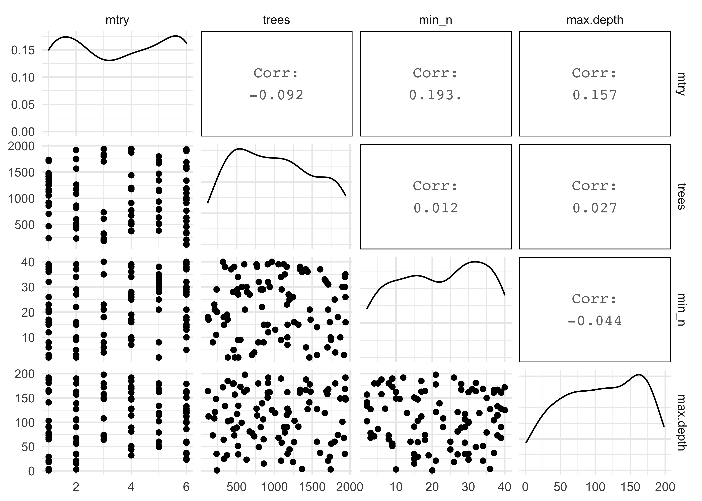
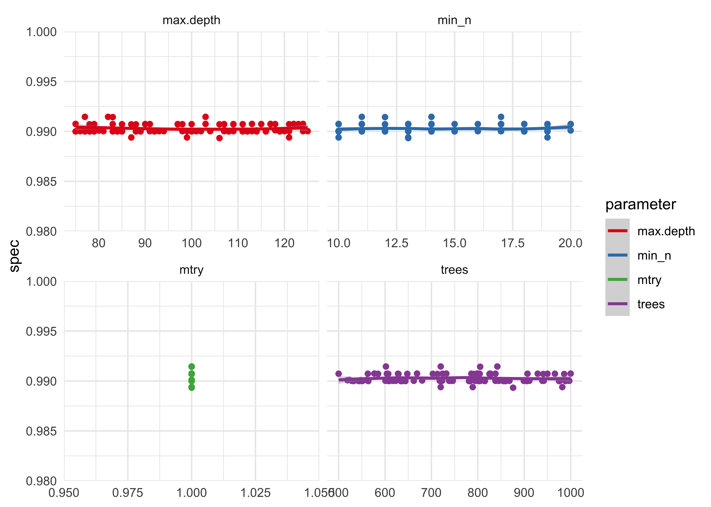
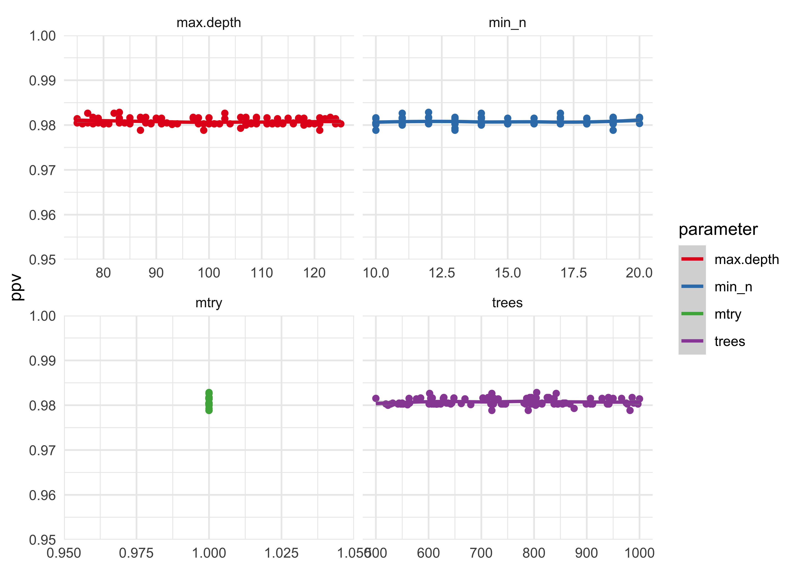

Hyperparameter tuning of the Random Forest Classifier
================

The purpose of this notebook is the comprehensively tune the
hyperparameters of a Random Forest (RF) Classifier for detecting states
of a push-up. The [*Hidden Markov Model-based learning
pipelines*](05_008_hmm_pipelines.md) notebook demonstrated that a RF is
likely the best model for this task, though did not pursue full
optimization of the classifier.

(Also try an XGBoost:
[tutorial](https://juliasilge.com/blog/xgboost-tune-volleyball/).)

**To-Do**:

-   clean up the XGBoost experimental section
-   comment on whether to use RF or XGBoost
-   select optimal hyperparameters for best model

Data
----

The data used here was cached in [*Hidden Markov Model-based learning
pipelines*](05_008_hmm_pipelines.md).

    processed_pushup_data <- readRDS(
      here(file.path("cache", "hmm_processed_pushup_data.rds"))
    )
    processed_pushup_data

    #> # A tibble: 6 x 10
    #>   workout_idx exercise reps  date                data  wide_data model fit  
    #>         <int> <chr>    <chr> <dttm>              <lis> <list>    <lis> <lis>
    #> 1           1 Push-Ups 10    2020-10-03 17:43:59 <tib… <tibble … <dep… <dpm…
    #> 2           2 Push-Ups 10    2020-10-04 13:24:29 <tib… <tibble … <dep… <dpm…
    #> 3           3 Push-Ups 10    2020-10-04 13:25:57 <tib… <tibble … <dep… <dpm…
    #> 4           4 Push-Ups 10    2020-10-05 12:36:09 <tib… <tibble … <dep… <dpm…
    #> 5           5 Push-Ups 10    2020-10-05 12:36:49 <tib… <tibble … <dep… <dpm…
    #> 6           6 Push-Ups 10    2020-10-11 08:43:16 <tib… <tibble … <dep… <dpm…
    #> # … with 2 more variables: full_data <list>, classifier_data <list>

    # Data set of tuning model.
    pushup_data <- processed_pushup_data$classifier_data[[1]]

    # Training and testing split.
    pushup_split <- initial_split(pushup_data, strata = state)
    pushup_train <- training(pushup_split)
    pushup_test <- testing(pushup_split)

TidyModels workflow
-------------------

### Recipe

    pushup_spec <- recipe(
      state ~ time_step + idx + x + y + z + pitch + yaw + roll,
      data = pushup_train
    ) %>%
      update_role(idx, time_step, new_role = "ID")

    pushup_spec

    #> Data Recipe
    #> 
    #> Inputs:
    #> 
    #>       role #variables
    #>         ID          2
    #>    outcome          1
    #>  predictor          6

    pushup_spec$var_info

    #> # A tibble: 9 x 4
    #>   variable  type    role      source  
    #>   <chr>     <chr>   <chr>     <chr>   
    #> 1 time_step numeric ID        original
    #> 2 idx       numeric ID        original
    #> 3 x         numeric predictor original
    #> 4 y         numeric predictor original
    #> 5 z         numeric predictor original
    #> 6 pitch     numeric predictor original
    #> 7 yaw       numeric predictor original
    #> 8 roll      numeric predictor original
    #> 9 state     nominal outcome   original

### Model Specification

    tune_spec <- rand_forest(
      mtry = tune(),
      trees = tune(),
      min_n = tune()
    ) %>%
      set_mode("classification") %>%
      set_engine(
        "ranger",
        max.depth = tune()
      )

    tune_spec

    #> Random Forest Model Specification (classification)
    #> 
    #> Main Arguments:
    #>   mtry = tune()
    #>   trees = tune()
    #>   min_n = tune()
    #> 
    #> Engine-Specific Arguments:
    #>   max.depth = tune()
    #> 
    #> Computational engine: ranger

### Cross Validation data split

    pushup_cvfolds <- vfold_cv(pushup_train, v = 10)
    pushup_cvfolds

    #> #  10-fold cross-validation 
    #> # A tibble: 10 x 2
    #>    splits           id    
    #>    <list>           <chr> 
    #>  1 <split [680/76]> Fold01
    #>  2 <split [680/76]> Fold02
    #>  3 <split [680/76]> Fold03
    #>  4 <split [680/76]> Fold04
    #>  5 <split [680/76]> Fold05
    #>  6 <split [680/76]> Fold06
    #>  7 <split [681/75]> Fold07
    #>  8 <split [681/75]> Fold08
    #>  9 <split [681/75]> Fold09
    #> 10 <split [681/75]> Fold10

### Workflow

    pushup_tune_wf <- workflow() %>%
      add_recipe(pushup_spec) %>%
      add_model(tune_spec)

    pushup_tune_wf

    #> ══ Workflow ═══════════════════════════════════════════════════════════════════════════════════════════════
    #> Preprocessor: Recipe
    #> Model: rand_forest()
    #> 
    #> ── Preprocessor ───────────────────────────────────────────────────────────────────────────────────────────
    #> 0 Recipe Steps
    #> 
    #> ── Model ──────────────────────────────────────────────────────────────────────────────────────────────────
    #> Random Forest Model Specification (classification)
    #> 
    #> Main Arguments:
    #>   mtry = tune()
    #>   trees = tune()
    #>   min_n = tune()
    #> 
    #> Engine-Specific Arguments:
    #>   max.depth = tune()
    #> 
    #> Computational engine: ranger

### Hyperparameter grid search

#### Coarse random grid search

    # Param for `max.depth` hyperparameter
    max_depth <- new_quant_param(
      type = "integer",
      range = c(1, 200),
      inclusive = c(TRUE, TRUE),
      default = 50,
      trans = scales::identity_trans(),
      label = c(max_depth = "max.depth"),
      finalize = NULL
    )

    # Parameters for coarse tuning.
    rf_params_coarse <- pushup_tune_wf %>%
      parameters() %>%
      update(
        mtry = mtry(range = c(1L, 6L)),
        trees = trees(range = c(20L, 2000L)),
        min_n = min_n(),
        max.depth = max_depth
      )

    # Random coarse tuning grid.
    set.seed(0)
    coarse_rand_grid <- grid_random(rf_params_coarse, size = 100)
    GGally::ggpairs(coarse_rand_grid, progress = FALSE)

    #> Registered S3 method overwritten by 'GGally':
    #>   method from   
    #>   +.gg   ggplot2

<!-- -->

    # Metrics to collect.
    tuning_metric_set <- metric_set(
      sensitivity, specificity, accuracy, roc_auc, ppv
    )

    # Register cores for parallel processing.
    doParallel::registerDoParallel()

    stash(
      "rf_tune_coarse",
      depends_on = c("coarse_rand_grid", "tuning_metric_set"),
      {
        rf_tune_coarse <- tune_grid(
          pushup_tune_wf,
          resamples = pushup_cvfolds,
          grid = coarse_rand_grid,
          metrics = tuning_metric_set
        )
      }
    )

    #> Loading stashed object.

    rf_param_tuning_plot <- function(tune_res, metric, param1 = mtry, param2 = max.depth) {
      tune_res %>%
        collect_metrics() %>%
        filter(.metric == !!metric) %>%
        select(mean, {{ param1 }}:{{ param2 }}) %>%
        pivot_longer(
          {{ param1 }}:{{ param2 }},
          values_to = "value",
          names_to = "parameter"
        ) %>%
        ggplot(aes(value, mean, color = parameter)) +
        facet_wrap(~parameter, scales = "free_x") +
        geom_point(show.legend = FALSE) +
        geom_smooth(method = "loess", formula = "y ~ x") +
        scale_color_brewer(type = "qual", palette = "Set1") +
        labs(
          x = NULL,
          y = metric
        )
    }

    tibble(
      metric = c("accuracy", "roc_auc", "sens", "spec", "ppv"),
      y_min = c(0.96, 0.996, 0.96, 0.98, 0.95)
    ) %>%
      pwalk(function(metric, y_min) {
        p <- rf_param_tuning_plot(rf_tune_coarse, metric) +
          scale_y_continuous(
            limits = c(y_min, 1),
            expand = expansion(mult = c(0, 0))
          )
        plot(p)
      })

    #> Warning: Removed 8 rows containing non-finite values (stat_smooth).

    #> Warning: Removed 8 rows containing missing values (geom_point).

<!-- -->

    #> Warning: Removed 12 rows containing non-finite values (stat_smooth).

    #> Warning: Removed 12 rows containing missing values (geom_point).

<!-- -->

    #> Warning: Removed 8 rows containing non-finite values (stat_smooth).

    #> Warning: Removed 8 rows containing missing values (geom_point).

<!-- -->

    #> Warning: Removed 8 rows containing non-finite values (stat_smooth).

    #> Warning: Removed 8 rows containing missing values (geom_point).

<!-- -->

    #> Warning: Removed 8 rows containing non-finite values (stat_smooth).

    #> Warning: Removed 8 rows containing missing values (geom_point).

<!-- -->

#### Fine random grid search

    # Param for `max.depth` hyperparameter
    max_depth2 <- new_quant_param(
      type = "integer",
      range = c(75, 125),
      inclusive = c(TRUE, TRUE),
      default = 100,
      trans = scales::identity_trans(),
      label = c(max_depth = "max.depth"),
      finalize = NULL
    )

    # Parameters for coarse tuning.
    rf_params_fine <- pushup_tune_wf %>%
      parameters() %>%
      update(
        mtry = mtry(range = c(1L, 1L)),
        trees = trees(range = c(500L, 1000L)),
        min_n = min_n(range = c(10, 20)),
        max.depth = max_depth2
      )

    # Random fine tuning grid.
    set.seed(0)
    fine_rand_grid <- grid_random(rf_params_fine, size = 100)

    stash(
      "rf_tune_fine",
      depends_on = c("fine_rand_grid", "tuning_metric_set"),
      {
        rf_tune_fine <- tune_grid(
          pushup_tune_wf,
          resamples = pushup_cvfolds,
          grid = fine_rand_grid,
          metrics = tuning_metric_set
        )
      }
    )

    #> Loading stashed object.

    tibble(
      metric = c("accuracy", "roc_auc", "sens", "spec", "ppv"),
      y_min = c(0.96, 0.996, 0.96, 0.98, 0.95)
    ) %>%
      pwalk(function(metric, y_min) {
        p <- rf_param_tuning_plot(rf_tune_fine, metric) +
          scale_y_continuous(
            limits = c(y_min, 1),
            expand = expansion(mult = c(0, 0))
          )
        plot(p)
      })

<!-- --><!-- --><!-- --><!-- --><!-- -->

------------------------------------------------------------------------

XGBoost
-------

    xgb_spec <- boost_tree(
      mtry = tune(),
      trees = tune(),
      min_n = tune(),
      tree_depth = tune(),
      learn_rate = tune(),
      loss_reduction = tune(),
      sample_size = tune()
    ) %>%
      set_engine("xgboost") %>% 
      set_mode("classification")

    xgb_spec

    #> Boosted Tree Model Specification (classification)
    #> 
    #> Main Arguments:
    #>   mtry = tune()
    #>   trees = tune()
    #>   min_n = tune()
    #>   tree_depth = tune()
    #>   learn_rate = tune()
    #>   loss_reduction = tune()
    #>   sample_size = tune()
    #> 
    #> Computational engine: xgboost

    pushup_xgb_tune_wf <- workflow() %>%
      add_recipe(pushup_spec) %>%
      add_model(xgb_spec)

    set.seed(0)
    xgb_coarse_grid <- grid_random(
      mtry(range = c(1L, 6L)),
      trees(range = c(50, 2000)),
      min_n(),
      tree_depth(),
      learn_rate(),
      loss_reduction(),
      sample_size = sample_prop(),
      size = 100
    )

    stash(
      "xgb_tune_coarse",
      depends_on = c("xgb_coarse_grid", "tuning_metric_set"),
      {
        xgb_tune_coarse <- tune_grid(
          pushup_xgb_tune_wf,
          resamples = pushup_cvfolds,
          grid = xgb_coarse_grid,
          metrics = tuning_metric_set
        )
      }
    )

    #> Loading stashed object.

    tibble(
      metric = c("accuracy", "roc_auc", "sens", "spec", "ppv"),
      y_min = c(0.95, 0.95, 0.95, 0.95, 0.95)
    ) %>%
      pwalk(function(metric, y_min) {
        p <- rf_param_tuning_plot(
          xgb_tune_coarse, 
          metric, 
          param1 = mtry, 
          param2 = loss_reduction
        ) +
          scale_y_continuous(
            limits = c(y_min, 1),
            expand = expansion(mult = c(0, 0))
          )
        plot(p)
      })

<!-- --><!-- --><!-- --><!-- --><!-- -->
