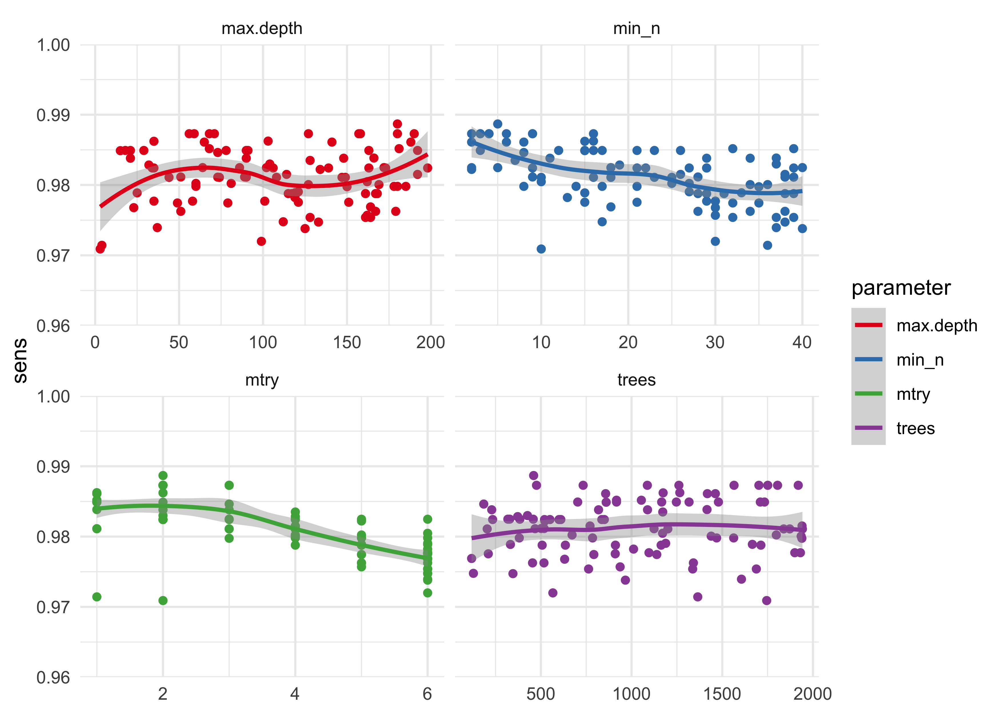
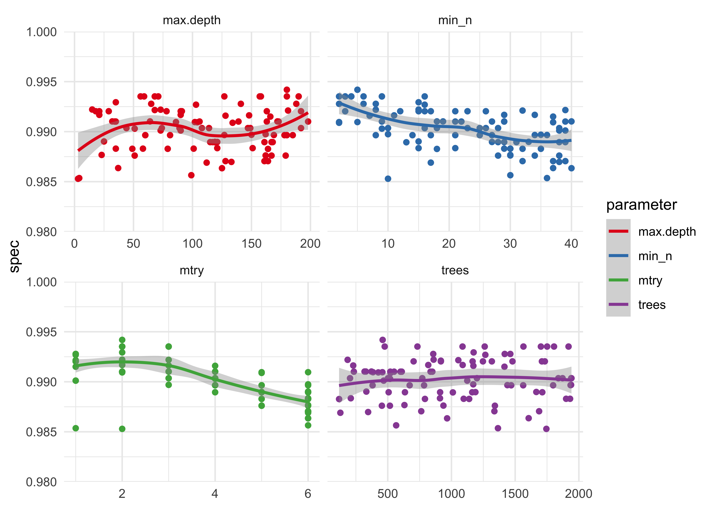

Hyperparameter tuning of the Random Forest Classifier
================

The purpose of this notebook is the comprehensively tune the
hyperparameters of a Random Forest (RF) Classifier for detecting states
of a push-up. The [*Hidden Markov Model-based learning
pipelines*](05_008_hmm_pipelines.md) notebook demonstrated that a RF is
likely the best model for this task, though did not pursue full
optimization of the classifier.

At the end, an XGBoost model is also trained and tuned as a potential
replacement for the RF.

Two blog-posts from Dr. Julia Silge that were useful guides for
hyperparameter turning with the [‘TidyModels’]() library: [*Tuning
random forest hyperparameters with \#TidyTuesday trees
data*](https://juliasilge.com/blog/sf-trees-random-tuning/) and [*Tune
XGBoost with tidymodels and \#TidyTuesday beach
volleyball*](https://juliasilge.com/blog/xgboost-tune-volleyball/).

Data
----

The data used here was cached in [*Hidden Markov Model-based learning
pipelines*](05_008_hmm_pipelines.md).

    processed_pushup_data <- readRDS(
      here(file.path("cache", "hmm_processed_pushup_data.rds"))
    )
    processed_pushup_data

    #> # A tibble: 6 x 10
    #>   workout_idx exercise reps  date                data  wide_data model fit  
    #>         <int> <chr>    <chr> <dttm>              <lis> <list>    <lis> <lis>
    #> 1           1 Push-Ups 10    2020-10-03 17:43:59 <tib… <tibble … <dep… <dpm…
    #> 2           2 Push-Ups 10    2020-10-04 13:24:29 <tib… <tibble … <dep… <dpm…
    #> 3           3 Push-Ups 10    2020-10-04 13:25:57 <tib… <tibble … <dep… <dpm…
    #> 4           4 Push-Ups 10    2020-10-05 12:36:09 <tib… <tibble … <dep… <dpm…
    #> 5           5 Push-Ups 10    2020-10-05 12:36:49 <tib… <tibble … <dep… <dpm…
    #> 6           6 Push-Ups 10    2020-10-11 08:43:16 <tib… <tibble … <dep… <dpm…
    #> # … with 2 more variables: full_data <list>, classifier_data <list>

    # Data set of tuning model.
    pushup_data <- processed_pushup_data$classifier_data[[1]]

    # Training and testing split.
    pushup_split <- initial_split(pushup_data, strata = state)
    pushup_train <- training(pushup_split)
    pushup_test <- testing(pushup_split)

TidyModels workflow
-------------------

### Recipe

    pushup_spec <- recipe(
      state ~ time_step + idx + x + y + z + pitch + yaw + roll,
      data = pushup_train
    ) %>%
      update_role(idx, time_step, new_role = "ID")

    pushup_spec

    #> Data Recipe
    #> 
    #> Inputs:
    #> 
    #>       role #variables
    #>         ID          2
    #>    outcome          1
    #>  predictor          6

    pushup_spec$var_info

    #> # A tibble: 9 x 4
    #>   variable  type    role      source  
    #>   <chr>     <chr>   <chr>     <chr>   
    #> 1 time_step numeric ID        original
    #> 2 idx       numeric ID        original
    #> 3 x         numeric predictor original
    #> 4 y         numeric predictor original
    #> 5 z         numeric predictor original
    #> 6 pitch     numeric predictor original
    #> 7 yaw       numeric predictor original
    #> 8 roll      numeric predictor original
    #> 9 state     nominal outcome   original

### Model Specification

    tune_spec <- rand_forest(
      mtry = tune(),
      trees = tune(),
      min_n = tune()
    ) %>%
      set_mode("classification") %>%
      set_engine(
        "ranger",
        max.depth = tune()
      )

    tune_spec

    #> Random Forest Model Specification (classification)
    #> 
    #> Main Arguments:
    #>   mtry = tune()
    #>   trees = tune()
    #>   min_n = tune()
    #> 
    #> Engine-Specific Arguments:
    #>   max.depth = tune()
    #> 
    #> Computational engine: ranger

### Cross Validation data split

    pushup_cvfolds <- vfold_cv(pushup_train, v = 10)
    pushup_cvfolds

    #> #  10-fold cross-validation 
    #> # A tibble: 10 x 2
    #>    splits           id    
    #>    <list>           <chr> 
    #>  1 <split [680/76]> Fold01
    #>  2 <split [680/76]> Fold02
    #>  3 <split [680/76]> Fold03
    #>  4 <split [680/76]> Fold04
    #>  5 <split [680/76]> Fold05
    #>  6 <split [680/76]> Fold06
    #>  7 <split [681/75]> Fold07
    #>  8 <split [681/75]> Fold08
    #>  9 <split [681/75]> Fold09
    #> 10 <split [681/75]> Fold10

### Workflow

    pushup_tune_wf <- workflow() %>%
      add_recipe(pushup_spec) %>%
      add_model(tune_spec)

    pushup_tune_wf

    #> ══ Workflow ════════════════════════════════════════════════════════════════════
    #> Preprocessor: Recipe
    #> Model: rand_forest()
    #> 
    #> ── Preprocessor ────────────────────────────────────────────────────────────────
    #> 0 Recipe Steps
    #> 
    #> ── Model ───────────────────────────────────────────────────────────────────────
    #> Random Forest Model Specification (classification)
    #> 
    #> Main Arguments:
    #>   mtry = tune()
    #>   trees = tune()
    #>   min_n = tune()
    #> 
    #> Engine-Specific Arguments:
    #>   max.depth = tune()
    #> 
    #> Computational engine: ranger

### Hyperparameter grid search

#### Coarse random grid search

    # Parameters for coarse tuning.
    rf_params_coarse <- pushup_tune_wf %>%
      parameters() %>%
      update(
        mtry = mtry(range = c(1L, 6L)),
        trees = trees(range = c(100L, 2000L)),
        min_n = min_n(),
        max.depth = tree_depth(range = c(1, 200))
      )

    # Random coarse tuning grid.
    set.seed(0)
    coarse_rand_grid <- grid_random(rf_params_coarse, size = 100)
    GGally::ggpairs(coarse_rand_grid, progress = FALSE)

    #> Registered S3 method overwritten by 'GGally':
    #>   method from   
    #>   +.gg   ggplot2

<!-- -->

    # Metrics to collect.
    tuning_metric_set <- metric_set(
      sensitivity, specificity, accuracy, roc_auc, ppv
    )

    # Register cores for parallel processing.
    doParallel::registerDoParallel()

    stash(
      "rf_tune_coarse",
      depends_on = c("coarse_rand_grid", "tuning_metric_set"),
      {
        rf_tune_coarse <- tune_grid(
          pushup_tune_wf,
          resamples = pushup_cvfolds,
          grid = coarse_rand_grid,
          metrics = tuning_metric_set
        )
      }
    )

    #> Loading stashed object.

    # Plot the results of a `metric` for all of the tuning hyperparameters.
    rf_param_tuning_plot <- function(tune_res,
                                     metric,
                                     param1 = mtry,
                                     param2 = max.depth) {
      tune_res %>%
        collect_metrics() %>%
        filter(.metric == !!metric) %>%
        select(mean, {{ param1 }}:{{ param2 }}) %>%
        pivot_longer(
          {{ param1 }}:{{ param2 }},
          values_to = "value",
          names_to = "parameter"
        ) %>%
        ggplot(aes(value, mean, color = parameter)) +
        facet_wrap(~parameter, scales = "free_x") +
        geom_point(show.legend = FALSE) +
        geom_smooth(method = "loess", formula = "y ~ x") +
        scale_color_brewer(type = "qual", palette = "Set1") +
        labs(
          x = NULL,
          y = metric
        )
    }

    tibble(
      metric = c("accuracy", "roc_auc", "sens", "spec", "ppv"),
      y_min = c(0.96, 0.996, 0.96, 0.98, 0.95)
    ) %>%
      pwalk(function(metric, y_min) {
        p <- rf_param_tuning_plot(rf_tune_coarse, metric) +
          scale_y_continuous(
            limits = c(y_min, 1),
            expand = expansion(mult = c(0, 0))
          )
        plot(p)
      })

    #> Warning: Removed 4 rows containing non-finite values (stat_smooth).

    #> Warning: Removed 4 rows containing missing values (geom_point).

<!-- -->

    #> Warning: Removed 4 rows containing non-finite values (stat_smooth).

    #> Warning: Removed 4 rows containing missing values (geom_point).

<!-- -->

    #> Warning: Removed 4 rows containing non-finite values (stat_smooth).

    #> Warning: Removed 4 rows containing missing values (geom_point).

<!-- -->

    #> Warning: Removed 4 rows containing non-finite values (stat_smooth).

    #> Warning: Removed 4 rows containing missing values (geom_point).

<!-- -->

    #> Warning: Removed 4 rows containing non-finite values (stat_smooth).

    #> Warning: Removed 4 rows containing missing values (geom_point).

<!-- -->

    collect_metrics(rf_tune_coarse) %.%
      {
        group_by(.metric)
        top_n(n = 5, wt = mean)
        ungroup()
        arrange(.metric, mean, -mtry - trees - min_n - max.depth)
        mutate(idx = row_number())
        select(idx, mtry:.metric)
        pivot_longer(-c(.metric, idx))
      } %>%
      ggplot(aes(x = .metric, y = value)) +
      facet_wrap(~name, scales = "free_y") +
      geom_boxplot(aes(color = .metric, fill = .metric), outlier.shape = NA, alpha = 0.1) +
      geom_jitter(aes(color = .metric), height = 0, width = 0.2, alpha = 0.8)

<!-- -->

#### Fine random grid search

    # Parameters for coarse tuning.
    rf_params_fine <- pushup_tune_wf %>%
      parameters() %>%
      update(
        mtry = mtry(range = c(2L, 3L)),
        trees = trees(range = c(1000L, 2000L)),
        min_n = min_n(range = c(3, 20)),
        max.depth = tree_depth(range = c(2, 10))
      )

    # Random fine tuning grid.
    set.seed(0)
    fine_rand_grid <- grid_random(rf_params_fine, size = 100)

    stash(
      "rf_tune_fine",
      depends_on = c("fine_rand_grid", "tuning_metric_set"),
      {
        rf_tune_fine <- tune_grid(
          pushup_tune_wf,
          resamples = pushup_cvfolds,
          grid = fine_rand_grid,
          metrics = tuning_metric_set
        )
      }
    )

    #> Loading stashed object.

    tibble(
      metric = c("accuracy", "roc_auc", "sens", "spec", "ppv"),
      y_min = c(0.96, 0.996, 0.96, 0.98, 0.95)
    ) %>%
      pwalk(function(metric, y_min) {
        p <- rf_param_tuning_plot(rf_tune_fine, metric) +
          scale_y_continuous(
            limits = c(y_min, 1),
            expand = expansion(mult = c(0, 0))
          )
        plot(p)
      })

    #> Warning: Removed 52 rows containing non-finite values (stat_smooth).

    #> Warning in simpleLoess(y, x, w, span, degree = degree, parametric =
    #> parametric, : pseudoinverse used at 1.995

    #> Warning in simpleLoess(y, x, w, span, degree = degree, parametric =
    #> parametric, : neighborhood radius 1.005

    #> Warning in simpleLoess(y, x, w, span, degree = degree, parametric =
    #> parametric, : reciprocal condition number 0

    #> Warning in simpleLoess(y, x, w, span, degree = degree, parametric =
    #> parametric, : There are other near singularities as well. 1.01

    #> Warning in predLoess(object$y, object$x, newx = if
    #> (is.null(newdata)) object$x else if (is.data.frame(newdata))
    #> as.matrix(model.frame(delete.response(terms(object)), : pseudoinverse used at
    #> 1.995

    #> Warning in predLoess(object$y, object$x, newx = if
    #> (is.null(newdata)) object$x else if (is.data.frame(newdata))
    #> as.matrix(model.frame(delete.response(terms(object)), : neighborhood radius
    #> 1.005

    #> Warning in predLoess(object$y, object$x, newx = if
    #> (is.null(newdata)) object$x else if (is.data.frame(newdata))
    #> as.matrix(model.frame(delete.response(terms(object)), : reciprocal condition
    #> number 0

    #> Warning in predLoess(object$y, object$x, newx = if
    #> (is.null(newdata)) object$x else if (is.data.frame(newdata))
    #> as.matrix(model.frame(delete.response(terms(object)), : There are other near
    #> singularities as well. 1.01

    #> Warning: Removed 52 rows containing missing values (geom_point).

<!-- -->

    #> Warning: Removed 52 rows containing non-finite values (stat_smooth).

    #> Warning in simpleLoess(y, x, w, span, degree = degree, parametric =
    #> parametric, : pseudoinverse used at 1.995

    #> Warning in simpleLoess(y, x, w, span, degree = degree, parametric =
    #> parametric, : neighborhood radius 1.005

    #> Warning in simpleLoess(y, x, w, span, degree = degree, parametric =
    #> parametric, : reciprocal condition number 0

    #> Warning in simpleLoess(y, x, w, span, degree = degree, parametric =
    #> parametric, : There are other near singularities as well. 1.01

    #> Warning in predLoess(object$y, object$x, newx = if
    #> (is.null(newdata)) object$x else if (is.data.frame(newdata))
    #> as.matrix(model.frame(delete.response(terms(object)), : pseudoinverse used at
    #> 1.995

    #> Warning in predLoess(object$y, object$x, newx = if
    #> (is.null(newdata)) object$x else if (is.data.frame(newdata))
    #> as.matrix(model.frame(delete.response(terms(object)), : neighborhood radius
    #> 1.005

    #> Warning in predLoess(object$y, object$x, newx = if
    #> (is.null(newdata)) object$x else if (is.data.frame(newdata))
    #> as.matrix(model.frame(delete.response(terms(object)), : reciprocal condition
    #> number 0

    #> Warning in predLoess(object$y, object$x, newx = if
    #> (is.null(newdata)) object$x else if (is.data.frame(newdata))
    #> as.matrix(model.frame(delete.response(terms(object)), : There are other near
    #> singularities as well. 1.01

    #> Warning: Removed 52 rows containing missing values (geom_point).

<!-- -->

    #> Warning: Removed 52 rows containing non-finite values (stat_smooth).

    #> Warning in simpleLoess(y, x, w, span, degree = degree, parametric =
    #> parametric, : pseudoinverse used at 1.995

    #> Warning in simpleLoess(y, x, w, span, degree = degree, parametric =
    #> parametric, : neighborhood radius 1.005

    #> Warning in simpleLoess(y, x, w, span, degree = degree, parametric =
    #> parametric, : reciprocal condition number 0

    #> Warning in simpleLoess(y, x, w, span, degree = degree, parametric =
    #> parametric, : There are other near singularities as well. 1.01

    #> Warning in predLoess(object$y, object$x, newx = if
    #> (is.null(newdata)) object$x else if (is.data.frame(newdata))
    #> as.matrix(model.frame(delete.response(terms(object)), : pseudoinverse used at
    #> 1.995

    #> Warning in predLoess(object$y, object$x, newx = if
    #> (is.null(newdata)) object$x else if (is.data.frame(newdata))
    #> as.matrix(model.frame(delete.response(terms(object)), : neighborhood radius
    #> 1.005

    #> Warning in predLoess(object$y, object$x, newx = if
    #> (is.null(newdata)) object$x else if (is.data.frame(newdata))
    #> as.matrix(model.frame(delete.response(terms(object)), : reciprocal condition
    #> number 0

    #> Warning in predLoess(object$y, object$x, newx = if
    #> (is.null(newdata)) object$x else if (is.data.frame(newdata))
    #> as.matrix(model.frame(delete.response(terms(object)), : There are other near
    #> singularities as well. 1.01

    #> Warning: Removed 52 rows containing missing values (geom_point).

<!-- -->

    #> Warning: Removed 52 rows containing non-finite values (stat_smooth).

    #> Warning in simpleLoess(y, x, w, span, degree = degree, parametric =
    #> parametric, : pseudoinverse used at 1.995

    #> Warning in simpleLoess(y, x, w, span, degree = degree, parametric =
    #> parametric, : neighborhood radius 1.005

    #> Warning in simpleLoess(y, x, w, span, degree = degree, parametric =
    #> parametric, : reciprocal condition number 0

    #> Warning in simpleLoess(y, x, w, span, degree = degree, parametric =
    #> parametric, : There are other near singularities as well. 1.01

    #> Warning in predLoess(object$y, object$x, newx = if
    #> (is.null(newdata)) object$x else if (is.data.frame(newdata))
    #> as.matrix(model.frame(delete.response(terms(object)), : pseudoinverse used at
    #> 1.995

    #> Warning in predLoess(object$y, object$x, newx = if
    #> (is.null(newdata)) object$x else if (is.data.frame(newdata))
    #> as.matrix(model.frame(delete.response(terms(object)), : neighborhood radius
    #> 1.005

    #> Warning in predLoess(object$y, object$x, newx = if
    #> (is.null(newdata)) object$x else if (is.data.frame(newdata))
    #> as.matrix(model.frame(delete.response(terms(object)), : reciprocal condition
    #> number 0

    #> Warning in predLoess(object$y, object$x, newx = if
    #> (is.null(newdata)) object$x else if (is.data.frame(newdata))
    #> as.matrix(model.frame(delete.response(terms(object)), : There are other near
    #> singularities as well. 1.01

    #> Warning: Removed 52 rows containing missing values (geom_point).

<!-- -->

    #> Warning: Removed 44 rows containing non-finite values (stat_smooth).

    #> Warning in simpleLoess(y, x, w, span, degree = degree, parametric =
    #> parametric, : pseudoinverse used at 1.995

    #> Warning in simpleLoess(y, x, w, span, degree = degree, parametric =
    #> parametric, : neighborhood radius 1.005

    #> Warning in simpleLoess(y, x, w, span, degree = degree, parametric =
    #> parametric, : reciprocal condition number 0

    #> Warning in simpleLoess(y, x, w, span, degree = degree, parametric =
    #> parametric, : There are other near singularities as well. 1.01

    #> Warning in predLoess(object$y, object$x, newx = if
    #> (is.null(newdata)) object$x else if (is.data.frame(newdata))
    #> as.matrix(model.frame(delete.response(terms(object)), : pseudoinverse used at
    #> 1.995

    #> Warning in predLoess(object$y, object$x, newx = if
    #> (is.null(newdata)) object$x else if (is.data.frame(newdata))
    #> as.matrix(model.frame(delete.response(terms(object)), : neighborhood radius
    #> 1.005

    #> Warning in predLoess(object$y, object$x, newx = if
    #> (is.null(newdata)) object$x else if (is.data.frame(newdata))
    #> as.matrix(model.frame(delete.response(terms(object)), : reciprocal condition
    #> number 0

    #> Warning in predLoess(object$y, object$x, newx = if
    #> (is.null(newdata)) object$x else if (is.data.frame(newdata))
    #> as.matrix(model.frame(delete.response(terms(object)), : There are other near
    #> singularities as well. 1.01

    #> Warning: Removed 44 rows containing missing values (geom_point).

<!-- -->

    metrics <- unique(collect_metrics(rf_tune_fine)$.metric)[1:3]
    map_dfr(metrics, ~ show_best(rf_tune_fine, metric = .x)) %>%
      knitr::kable(format = "markdown")

| mtry | trees | min\_n | max.depth | .metric  | .estimator |      mean |   n |  std\_err | .config  |
|-----:|------:|-------:|----------:|:---------|:-----------|----------:|----:|----------:|:---------|
|    2 |  1360 |     10 |         8 | accuracy | multiclass | 0.9880702 |  10 | 0.0046268 | Model075 |
|    2 |  1134 |      6 |        10 | accuracy | multiclass | 0.9880702 |  10 | 0.0046268 | Model085 |
|    2 |  1286 |      5 |         7 | accuracy | multiclass | 0.9867368 |  10 | 0.0052490 | Model008 |
|    3 |  1575 |      7 |        10 | accuracy | multiclass | 0.9867368 |  10 | 0.0052490 | Model020 |
|    2 |  1989 |      9 |         8 | accuracy | multiclass | 0.9867368 |  10 | 0.0052490 | Model021 |
|    2 |  1360 |     10 |         8 | ppv      | macro      | 0.9877772 |  10 | 0.0048046 | Model075 |
|    2 |  1134 |      6 |        10 | ppv      | macro      | 0.9877772 |  10 | 0.0048046 | Model085 |
|    2 |  1286 |      5 |         7 | ppv      | macro      | 0.9864860 |  10 | 0.0053903 | Model008 |
|    3 |  1575 |      7 |        10 | ppv      | macro      | 0.9864860 |  10 | 0.0053903 | Model020 |
|    2 |  1989 |      9 |         8 | ppv      | macro      | 0.9864860 |  10 | 0.0053903 | Model021 |
|    2 |  1128 |      5 |         8 | roc\_auc | hand\_till | 0.9997179 |  10 | 0.0001478 | Model030 |
|    2 |  1134 |      6 |        10 | roc\_auc | hand\_till | 0.9997179 |  10 | 0.0001478 | Model085 |
|    2 |  1286 |      5 |         7 | roc\_auc | hand\_till | 0.9996613 |  10 | 0.0001732 | Model008 |
|    2 |  1989 |      9 |         8 | roc\_auc | hand\_till | 0.9996613 |  10 | 0.0001732 | Model021 |
|    2 |  1489 |      7 |         7 | roc\_auc | hand\_till | 0.9996613 |  10 | 0.0001732 | Model022 |

### Optimal hyperparameters

| **hyperparameter** | **value** |
|--------------------|-----------|
| mtry               | 2         |
| trees              | 1200      |
| min\_n             | 9         |
| max.depth          | 8         |

------------------------------------------------------------------------

XGBoost
-------

If a RF classifier performs well, often a XGBoost can increased
performance. Therefore, some exploration of this drop-in replacement is
conducted below.

### Tuning hyperparameters

    xgb_spec <- boost_tree(
      mtry = tune(),
      trees = tune(),
      min_n = tune(),
      tree_depth = tune(),
      learn_rate = tune(),
      loss_reduction = tune(),
      sample_size = tune()
    ) %>%
      set_engine("xgboost") %>%
      set_mode("classification")

    xgb_spec

    #> Boosted Tree Model Specification (classification)
    #> 
    #> Main Arguments:
    #>   mtry = tune()
    #>   trees = tune()
    #>   min_n = tune()
    #>   tree_depth = tune()
    #>   learn_rate = tune()
    #>   loss_reduction = tune()
    #>   sample_size = tune()
    #> 
    #> Computational engine: xgboost

    pushup_xgb_tune_wf <- workflow() %>%
      add_recipe(pushup_spec) %>%
      add_model(xgb_spec)

    set.seed(0)
    xgb_coarse_grid <- grid_random(
      mtry(range = c(1L, 6L)),
      trees(range = c(50, 2000)),
      min_n(),
      tree_depth(),
      learn_rate(),
      loss_reduction(),
      sample_size = sample_prop(),
      size = 100
    )

    stash(
      "xgb_tune_coarse",
      depends_on = c("xgb_coarse_grid", "tuning_metric_set"),
      {
        xgb_tune_coarse <- tune_grid(
          pushup_xgb_tune_wf,
          resamples = pushup_cvfolds,
          grid = xgb_coarse_grid,
          metrics = tuning_metric_set
        )
      }
    )

    #> Loading stashed object.

    tibble(
      metric = c("accuracy", "roc_auc", "sens", "spec", "ppv"),
      y_min = c(0.95, 0.95, 0.95, 0.95, 0.95)
    ) %>%
      pwalk(function(metric, y_min) {
        p <- rf_param_tuning_plot(
          xgb_tune_coarse,
          metric,
          param1 = mtry,
          param2 = loss_reduction
        ) +
          scale_y_continuous(
            limits = c(y_min, 1),
            expand = expansion(mult = c(0, 0))
          )
        plot(p)
      })

<!-- --><!-- --><!-- --><!-- --><!-- -->

### Conclusion

It does not seem like there is improvement from using an XGBoost model,
likely because the RF model performed as well as could be hoped for.
There are drawbacks to using a boosted model (e.g. non-parallel
training), so I will continue with the RF.
