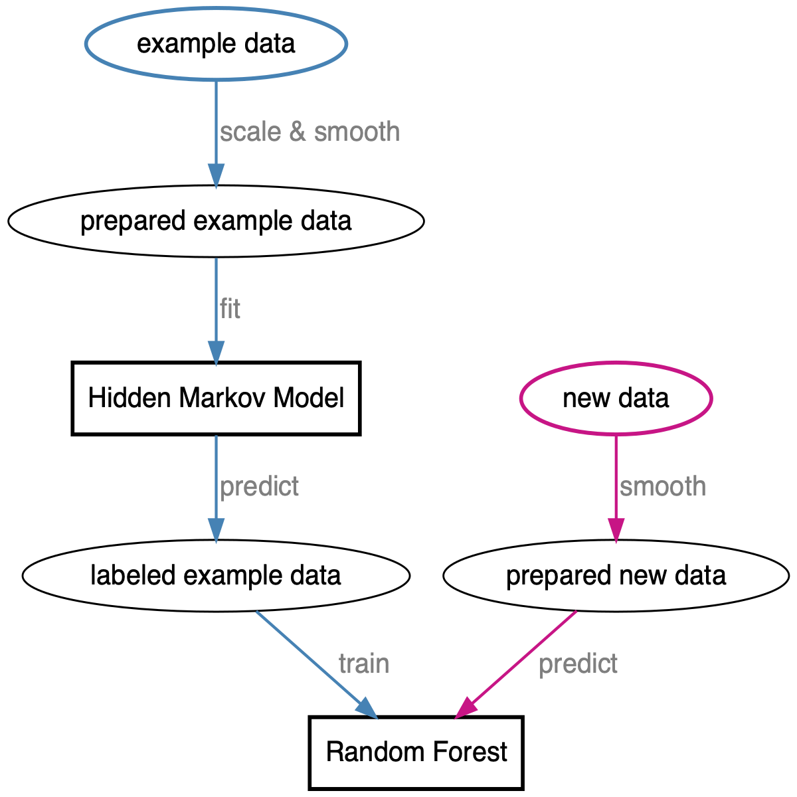

Classifier training and implementation pipeline
================

Goal
----

The goal of this notebook is to construct and refine a pipeline for
training and implementing a classifier that detects the states of a
push-up.

Pipeline
--------

The pipeline was first explored in the notebook [*Hidden Markov
Model-based learning pipelines*](05_008_hmm_pipelines.md). The following
pipeline is based on this previous work, though refined to better suit a
real use-case

### Steps

1.  Chop the raw data within an IQR of the time steps to get just the
    clean push-up data.
2.  Use an HMM to identify the 2 states of the push-up.
3.  Use the HMM to cut the chopped data into the 3 states of a push-up
    (one state as `unknown`).
4.  Train a classifier on this training data.
5.  Apply the classifier to new data as it is being collected.

### API

The key advancement of this notebook for this project needs to be the
construction of a pipeline that can operate under real-world
circumstances. Thus, the API is important because, though the model will
not be implemented in R, it will define the modularity of the pipeline.

------------------------------------------------------------------------

Data
----

    pushup_data <- tibble(filename = get_data_file_names(data_dir)) %.% {
      filter(str_detect(filename, "Push"))
      mutate(
        workout_idx = row_number(),
        all_data = map(filename, read_watch_data),
        file_info = map(all_data, ~ .x$meta_data),
        data = map(all_data, ~ .x$telemetry_data)
      )
    }

    train_dataset <- pushup_data$data[[1]]
    new_dataset <- pushup_data$data[[6]]

Pipeline
--------

### 1. Scale and smooth the data for the HMM

    zscale <- function(x, na.rm = TRUE) {
      (x - mean(x, na.rm = na.rm)) / sd(x, na.rm = na.rm)
    }

    apply_scale_trans <- function(df, x = value, y = scaled_value) {
      df %.% {
        group_by(axis, motion)
        mutate({{ y }} := zscale({{ x }}))
        ungroup()
      }
    }

    apply_smoothing_trans <- function(df,
                                      x = value,
                                      y = smooth_value,
                                      rolling_n = 10) {
      before_after <- round(rolling_n / 2)

      df %.% {
        group_by(axis, motion)
        mutate(
          {{ y }} := slider::slide_dbl(
            {{ x }},
            .f = ~ max(abs(.x)),
            .before = before_after,
            .after = before_after
          ),
          {{ y }} := slider::slide_dbl(
            {{ y }},
            .f = mean,
            .before = 2,
            .after = 2
          )
        )
        ungroup()
      }
    }

    transform_pushup_data <- function(df) {
      df %>%
        apply_scale_trans() %>%
        apply_smoothing_trans(x = scaled_value)
    }

    train_dataset <- transform_pushup_data(train_dataset) %>%
      select(-scaled_value)

### 2. Fit HMM

    pivot_telemetry_data <- function(telemetry_data, x = value) {
      telemetry_data %>%
        pivot_wider(
          c(date, idx),
          names_from = axis,
          values_from = {{ x }}
        )
    }

    prepare_hmm_fitting_data <- function(df, lower_q = 0.3, upper_q = 0.7) {
      df %>%
        filter(date > quantile(date, lower_q) & date < quantile(date, upper_q)) %>%
        pivot_telemetry_data(x = smooth_value)
    }

    construct_pushup_hmm <- function(d, nstates = 2) {
      depmix(
        list(
          x ~ 1,
          y ~ 1,
          z ~ 1,
          pitch ~ 1,
          roll ~ 1,
          yaw ~ 1
        ),
        data = d,
        nstates = nstates,
        family = list(
          gaussian(), gaussian(), gaussian(),
          gaussian(), gaussian(), gaussian()
        )
      )
    }

    hmm_fit_data <- prepare_hmm_fitting_data(train_dataset)
    pushup_hmm <- construct_pushup_hmm(hmm_fit_data)
    pushup_hmm <- fit(pushup_hmm)

    #> converged at iteration 47 with logLik: 935.1952

### 3. Chop data into states

    prepare_rf_training_data <- function(hmm, data, prob_cutoff = 0.9, outer_unknown_q = 0.1) {
      hmm_posterior <- bind_cols(
        data,
        posterior(hmm)
      ) %.% {
        slice(-1) # Drop the first data point (often unreliable).
        mutate(state = case_when(
          S1 > prob_cutoff ~ "state1",
          S2 > prob_cutoff ~ "state2",
          TRUE ~ "unknown"
        ))
      }

      unknown_data <- data %.% {
        filter(
          date < quantile(date, outer_unknown_q) |
            data > quantile(date, 1 - outer_unknown_q)
        )
        add_column(state = "unknown")
      }

      d <- bind_rows(hmm_posterior, unknown_data)
      d <- d[sample(nrow(d)), ] # shuffle rows
    }

    rf_training_data <- prepare_rf_training_data(pushup_hmm, hmm_fit_data)
    table(rf_training_data$state)

    #> 
    #>  state1  state2 unknown 
    #>     311     346     147

### 4. Train Random Forest Classifier

    run_rf_workflow <- function(data, mtry = 3, trees = 100) {
      rf_spec <- rand_forest(
        mode = "classification",
        mtry = mtry,
        trees = trees,
        min_n = 50
      ) %>%
        set_engine("ranger")
      run_classifier_workflow(data, rf_spec)
    }

    pushup_rf_res <- run_rf_workflow(rf_training_data, mtry = 1, trees = 16)
    pushup_rf <- pushup_rf_res$fit_model[[1]]

#### 5. Scale and smooth new data to be classified

(Needs to be processed as if it was new data streaming in.)
